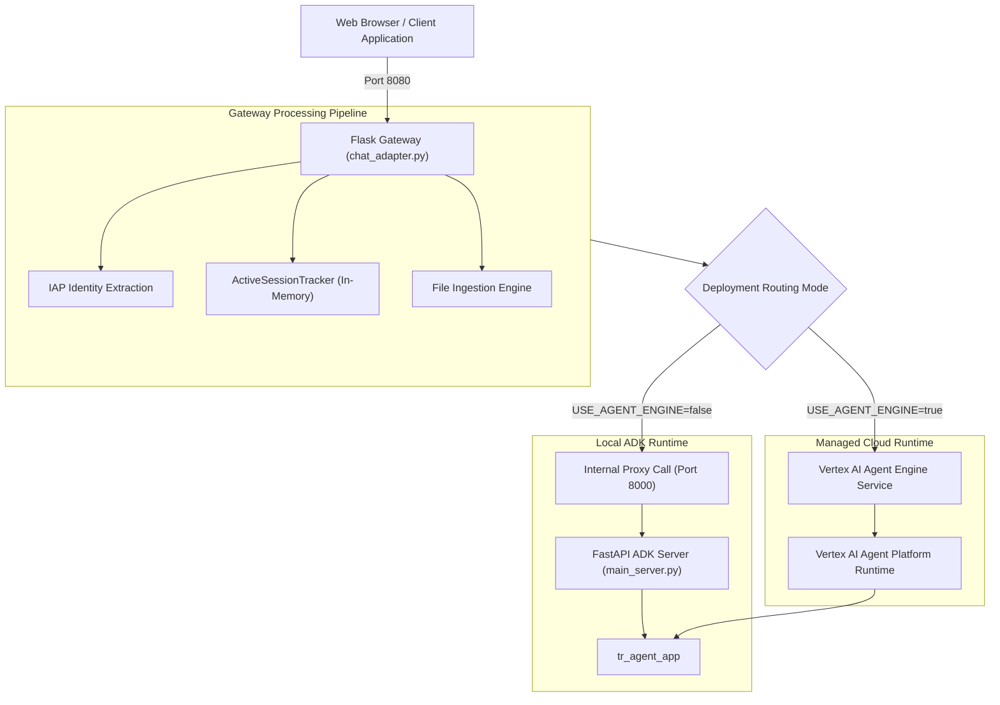
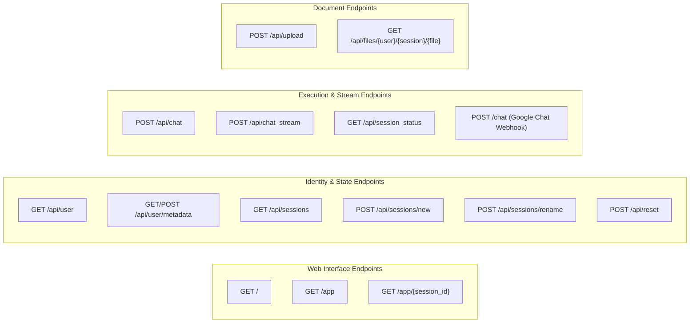
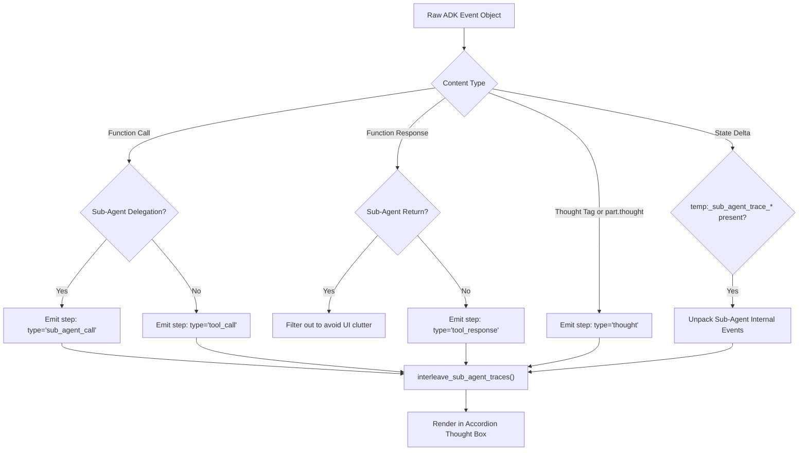

# API and Integration Guide

The TalentRadar Agent platform provides HTTP endpoints, Server-Sent Events (SSE) streaming protocols, and webhook interfaces for enterprise chat integration.

This document describes the dual-server hosting architecture, endpoint specifications, identity resolution headers, intermediate thought parsing, and Pydantic input coercion models.

## Dual-Server Runtime Architecture

The platform architecture divides responsibilities between two server entrypoints.

The FastAPI host mounts the native Agent Development Kit application, while the Flask gateway manages client sessions, authentication, file storage, and web presentation.



### FastAPI Native ADK Server (`main_server.py`)

The FastAPI application serves as the core agent execution engine.

Located in [main_server.py](file:///c:/Users/abanerjee/Documents/Projects/EDP_Projects/reg-adk-tr-agent/main_server.py), the application imports `tr_agent_app` from `tr_agent.agent`. It invokes `google.adk.cli.fast_api.get_fast_api_app` to instantiate standard ADK routes on port 8000. It includes custom exception handling to return structured JSON errors during unhandled execution faults.

### Flask Chat Adapter Gateway (`chat_adapter.py`)

The Flask application acts as the enterprise integration gateway.

Located in [chat_adapter.py](file:///c:/Users/abanerjee/Documents/Projects/EDP_Projects/reg-adk-tr-agent/chat_adapter.py), this process listens on port 8080. It serves static assets from `static/`, extracts user identities from Google Identity-Aware Proxy (IAP) headers, manages file uploads, and streams real-time thoughts to the web interface.

When `USE_AGENT_ENGINE` is enabled, the gateway uses `AgentPlatformBackend` to stream executions directly against the Vertex AI Agent Platform runtime (`europe-west1`).

## HTTP Endpoint Catalog

The gateway exposes a set of REST and streaming endpoints.



### Authentication and User Management

The user management endpoints resolve identity and persist user preferences:

- `GET /api/user`:
  - Inspects the `X-Goog-Authenticated-User-Email` HTTP header.
  - Strips identity provider prefixes (e.g. `accounts.google.com:`).
  - Returns `{"email": "user@example.com", "userId": "user-at-example-com"}`.

- `GET /api/user/metadata`:
  - Retrieves saved UI configuration, theme settings, and pinned sessions.
  - Reads from `sessions/user_metadata/<user_id>.json`.

- `POST /api/user/metadata`:
  - Updates and commits user preferences to disk.

### Session Management

Session endpoints control conversation lifecycles and historical reviews:

- `GET /api/sessions`:
  - Returns a list of active and archived session IDs for the authenticated user.

- `POST /api/sessions/new`:
  - Generates a new UUID session identifier and registers it with the session tracker.

- `POST /api/sessions/rename`:
  - Accepts `{"sessionId": "<uuid>", "title": "<new_title>"}` to assign custom labels to conversations.

- `POST /api/reset`:
  - Clears conversation state and resets the active session in `VertexAiSessionService`.

- `GET /api/history`:
  - Retrieves turn-by-turn event logs for the requested session ID.

### Chat Execution and Real-Time Streaming

The conversation endpoints execute agent turns and stream execution events:

- `POST /api/chat`:
  - Synchronous request returning a complete JSON response.
  - Payload: `{"prompt": "string", "sessionId": "string", "files": []}`.
  - Returns final assistant text along with parsed thought dictionaries.

- `POST /api/chat_stream`:
  - Server-Sent Events (SSE) streaming endpoint.
  - Emits incremental execution chunks with `text/event-stream` headers.
  - Stream events include `thought` (intermediate reasoning), `sub_agent_call` (delegation events), `tool_call` (tool execution), `tool_response` (tool outputs), and `text` (assistant response fragments).

- `GET /api/session_status`:
  - Queries `ActiveSessionTracker` for in-flight status (`generating`, `completed`, or `error`).

- `POST /chat`:
  - Google Chat interactive webhook endpoint.
  - Receives Google Chat space events and returns formatted cards or text messages.

### File Ingestion and Storage

The file management endpoints handle document attachments:

- `POST /api/upload`:
  - Accepts multipart form data containing document attachments.
  - Validates file extensions (`.txt`, `.json`, `.csv`, `.xls`, `.xlsx`, `.pdf`, `.png`, `.jpg`, `.jpeg`).
  - Writes files to `sessions/uploads/<user_id>/<session_id>/` or cloud storage buckets.
  - Invokes `read_and_parse_uploaded_file` to generate prompt context summaries.

- `GET /api/files/<user_id>/<session_id>/<filename>`:
  - Streams stored document attachments back to the browser for client download.

## Intermediate Thought Extraction and Trace Interleaving

The gateway parses intermediate agent execution events to render step-by-step progress bars in the chat interface.

The `extract_event_thoughts` function in [chat_adapter.py](file:///c:/Users/abanerjee/Documents/Projects/EDP_Projects/reg-adk-tr-agent/chat_adapter.py) processes the raw ADK event dictionary.



The `interleave_sub_agent_traces` function injects sub-agent internal actions directly beneath the corresponding delegation event. This ensures the web UI displays a coherent hierarchy of thoughts, database queries, and API calls.

## Pydantic Input Schemas and Coercion Engine

Sub-agents require structured input dictionaries. However, users frequently provide raw strings or unstructured follow-ups.

The platform implements an input coercion engine in [tr_agent/models.py](file:///c:/Users/abanerjee/Documents/Projects/EDP_Projects/reg-adk-tr-agent/tr_agent/models.py) to bridge this gap.

### Coercion Mechanics (`_coerce_input_data`)

Each sub-agent schema registers `_coerce_input_data` as a Pydantic `@model_validator(mode="before")`:

```python
def _coerce_input_data(cls, data: Any) -> Any:
    if isinstance(data, str):
        trimmed = data.strip()
        if (trimmed.startswith("{") and trimmed.endswith("}")) or (trimmed.startswith("[") and trimmed.endswith("]")):
            try:
                return json.loads(trimmed)
            except Exception:
                pass
        return {"prompt": trimmed}
    return data
```

The validator normalizes inputs through three stages:

1. String inspection: If the input is a plain text string (e.g. "Try again" or "Show average spend"), it wraps the text into a dictionary: `{"prompt": data}`.
2. Embedded JSON decoding: If the input is a serialized JSON string, the validator deserializes the string into a Python dictionary.
3. Passthrough: If the input is already a dictionary, the validator leaves it intact for standard field validation.

### Sub-Agent Model Reference

The platform defines five specialized input models.

#### Model Field Reference

The table below summarizes the fields and types configured across the sub-agent input models:

| Model Name | Field Name | Type | Description |
| :--- | :--- | :--- | :--- |
| `CodeAnalystInput` | `prompt` | `str` | Search request or inquiry |
| `CodeAnalystInput` | `specific_metric` | `Optional[str]` | Target metric name (e.g. `time_to_fill_cd`) |
| `CodeAnalystInput` | `search_type` | `str` | Search scope (`standard` or `custom`) |
| `CodeAnalystInput` | `client_name` | `Optional[str]` | Client account name |
| `CodeAnalystInput` | `source` | `Optional[str]` | Source application (`fg`, `bee`, `vn`, or `ntv`) |
| `CodeAnalystInput` | `subject_matter` | `Optional[str]` | Talent domain (`msp`, `rpo`, or `sow`) |
| `CodeAnalystInput` | `entity_type` | `Optional[str]` | Target entity (`assignment`, `requisition`, or `candidate`) |
| `SchemaAnalystInput` | `prompt` | `str` | Schema inquiry |
| `SchemaAnalystInput` | `client_name` | `Optional[str]` | Client account name |
| `SchemaAnalystInput` | `subject_matter` | `Optional[str]` | Domain classification |
| `SchemaAnalystInput` | `gold_entity_type` | `Optional[str]` | Target gold entity |
| `SchemaAnalystInput` | `slvr_entity_type` | `Optional[str]` | Source silver entity |
| `SchemaAnalystInput` | `specific_metric` | `Optional[str]` | Metric name |
| `SchemaAnalystInput` | `gold_field_name` | `Optional[str]` | Reporting field name |
| `SchemaAnalystInput` | `source` | `Optional[str]` | Vendor source platform |
| `SchemaAnalystInput` | `architecture_type` | `str` | Auto-detected architecture (`SCOPE` or `EDP`) |
| `BQMSPDataInput` | `prompt` | `str` | Question on requisitions, assignments, spend, or savings |
| `BQMSPDataInput` | `client_name` | `Optional[str]` | Client account name |
| `BQAnalystInput` | `prompt` | `str` | BigQuery inspection query |
| `BQAnalystInput` | `client_name` | `Optional[str]` | Client account name |
| `BQAnalystInput` | `slvr_entity_type` | `Optional[str]` | Table entity name |
| `BQAnalystInput` | `gold_entity_type` | `Optional[str]` | Standard reporting entity |
| `BQAnalystInput` | `architecture_type` | `str` | Platform architecture (`SCOPE` or `EDP`) |
| `JiraAgentInput` | `operation` | `Optional[str]` | Action type (`fetch`, `create`, `update`, `comment`, `get`, `metrics`) |
| `JiraAgentInput` | `project` | `Optional[str]` | Target Jira project key (e.g. `DET`, `EDP`) |
| `JiraAgentInput` | `epic` | `Optional[str]` | Parent epic key or link |
| `JiraAgentInput` | `team` | `Optional[str]` | Team custom field filter |
| `JiraAgentInput` | `summary` | `Optional[str]` | Issue title or text filter |
| `JiraAgentInput` | `description` | `Optional[str]` | Issue description or text filter |
| `JiraAgentInput` | `assignee` | `Optional[str]` | Assignee username or `currentUser()` |
| `JiraAgentInput` | `reporter` | `Optional[str]` | Reporter username |
| `JiraAgentInput` | `resolution` | `Optional[str]` | Resolution state (`Unresolved`, `Done`) |
| `JiraAgentInput` | `issue_type` | `Optional[str]` | Issue type (`Task`, `Story`, `Bug`, `Epic`) |
| `JiraAgentInput` | `priority` | `Optional[str]` | Priority level (`Highest`, `High`, `Medium`, `Low`, `Lowest`) |
| `JiraAgentInput` | `issue_key` | `Optional[str]` | Specific ticket key (e.g. `DET-101`) |
| `JiraAgentInput` | `comment` | `Optional[str]` | Comment text to post |
| `JiraAgentInput` | `raw_jql` | `Optional[str]` | Direct JQL query override |
| `JiraAgentInput` | `prompt` | `Optional[str]` | Natural language user request |
