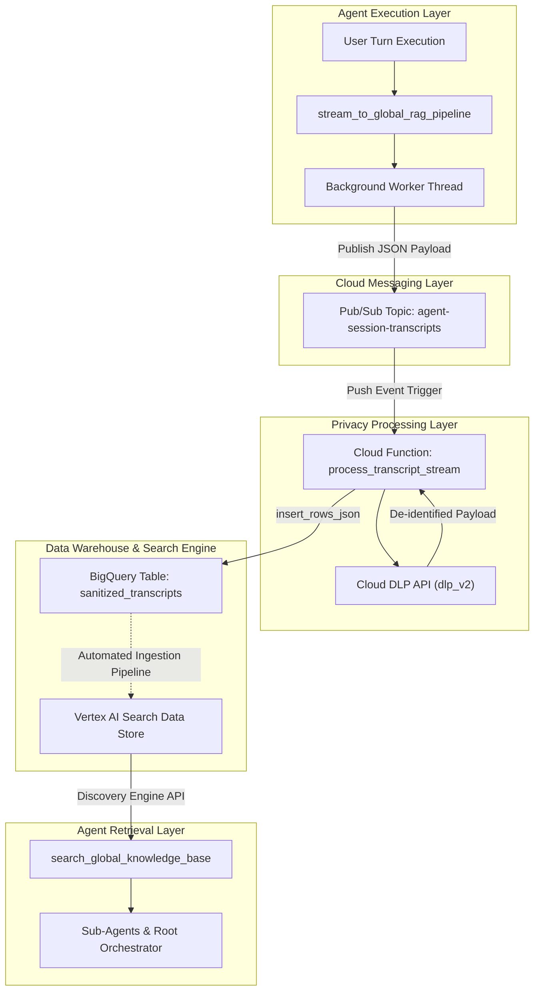
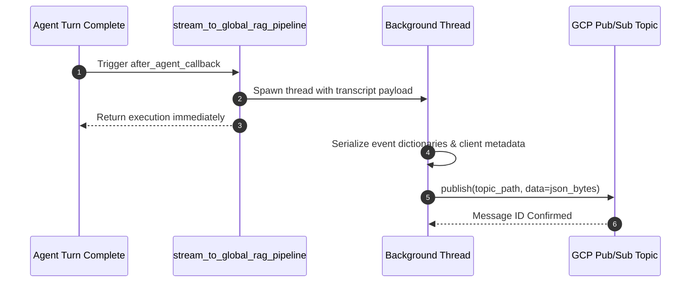
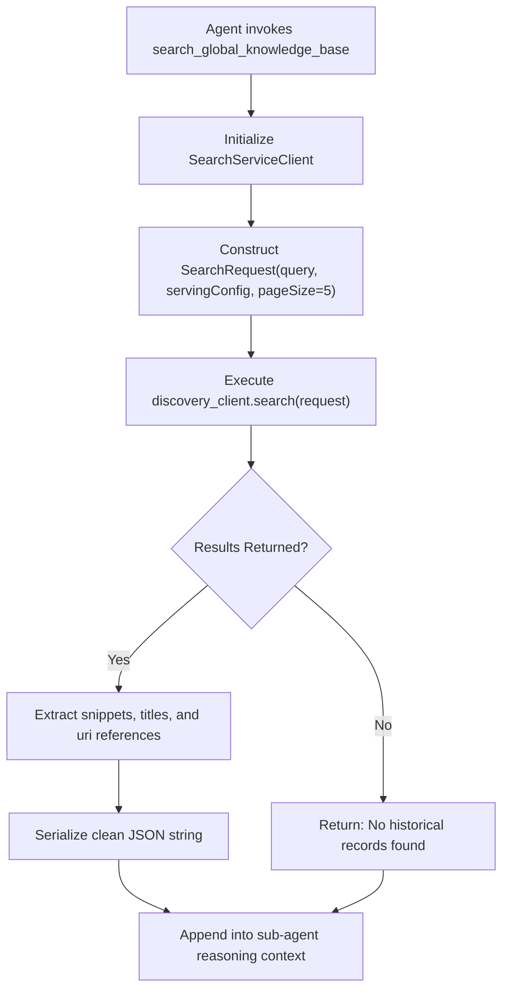

# Data Pipelines and Knowledge Systems

The TalentRadar Agent platform implements an automated knowledge pipeline that captures conversation telemetry, scrubs personally identifiable information, stores sanitized transcripts, and exposes historical context through semantic vector search.

This document describes the event streaming mechanics, Cloud DLP sanitization rules, BigQuery storage schemas, and Vertex AI Search retrieval pipelines.

## Architectural Data Flow

The telemetry and knowledge lifecycle operates as an asynchronous, decoupled event loop.

When a user interaction completes, the agent runtime emits a structured transcript payload. The payload moves through ingestion, privacy filtering, data warehousing, and search indexing before becoming retrievable in subsequent conversation turns.



## Telemetry Streaming Pipeline

The telemetry pipeline captures interaction data without adding latency to user requests.

The entrypoint is the `stream_to_global_rag_pipeline` function defined in [tr_agent/rag_integration.py](file:///c:/Users/abanerjee/Documents/Projects/EDP_Projects/reg-adk-tr-agent/tr_agent/rag_integration.py). It registers as an `after_agent_callback` on the master agent and sub-agents.

### Asynchronous Execution Model

Telemetry publication runs in detached worker threads.

When an agent turn concludes, the callback spawns a daemon thread via `threading.Thread(target=_publish_worker, ...)`. This execution model allows the HTTP response to return immediately to the client while network calls to Google Cloud Pub/Sub proceed in the background.



### Transcript Payload Schema

The published JSON message encapsulates the complete conversational event:

```json
{
  "timestamp": "2026-09-27T12:00:00.000000Z",
  "user_id": "user-at-example-com",
  "session_id": "c7a8b9d0-1234-5678-9abc-def012345678",
  "active_agent": "schema_analyst_agent",
  "client_code": "msp_fg_uk_siemens_rrbz",
  "user_prompt": "What is the source field name for assign.assignment_create_date_initial?",
  "agent_response": "The source field maps to Work Order Create Date_r0.",
  "tool_calls": [
    {
      "tool_name": "ask_data_agent",
      "arguments": {
        "query": "For client_code 'msp_fg_uk_siemens_rrbz', find mapping for assignment_create_date_initial"
      },
      "status": "success"
    }
  ]
}
```

## Cloud DLP Privacy De-identification

Before session transcripts are stored in the data warehouse, sensitive personal data is redacted by a serverless Cloud Function.

The source code in [process-transcript-stream-cf/main.py](file:///c:/Users/abanerjee/Documents/Projects/EDP_Projects/reg-adk-tr-agent/process-transcript-stream-cf/main.py) defines the `process_transcript_stream` Cloud Function triggered by messages on `agent-session-transcripts`.

### Inspected InfoTypes and Surrogate Replacement

The function submits message text to the Google Cloud Data Loss Prevention API (`dlp_v2.DlpServiceClient`).

The inspection configuration targets three distinct personal identifying infoTypes:

- `PERSON_NAME`: Individual user and candidate names.
- `EMAIL_ADDRESS`: Corporate and personal email strings.
- `PHONE_NUMBER`: Regional and international phone numbers.

Detected matches undergo surrogate masking. The DLP service replaces matched substrings with bracketed tokens (`[PERSON_NAME]`, `[EMAIL_ADDRESS]`, and `[PHONE_NUMBER]`). This transformation preserves grammatical readability for semantic search models while stripping confidential details.

### BigQuery Ingestion Schema

Sanitized records are committed to Google BigQuery via direct streaming insert:

```sql
CREATE TABLE `rsr-bi-group-dev-c874.reg_adk_tr_agent_knowledge.sanitized_transcripts` (
    timestamp TIMESTAMP,
    user_id STRING,
    session_id STRING,
    active_agent STRING,
    client_code STRING,
    sanitized_user_prompt STRING,
    sanitized_agent_response STRING,
    tool_calls STRING
);
```

The function invokes `bigquery.Client().insert_rows_json(table_ref, [record])`. If insertion errors occur, details are written to Cloud Logging for operator inspection.

## Vertex AI Search Knowledge Retrieval

Historical system context, known mapping exceptions, and past data anomalies are queried via the `search_global_knowledge_base` tool.

The tool provides all sub-agents with semantic search access to historical system interactions.

### Discovery Engine Search Configuration

The search engine queries Google Cloud Discovery Engine endpoints:

- Endpoint format: `projects/{project_id}/locations/global/collections/default_collection/engines/{engine_id}/servingConfigs/default_search`
- Target engine: Configured via the `VERTEX_SEARCH_ENGINE_ID` environment variable.
- Result pagination: Defaults to the top 5 matching records per search query.

### Query Execution and Snippet Parsing

When an agent invokes `search_global_knowledge_base(query="mapping error for Siemens")`, the tool executes the following process:



The parser inspects `derived_struct_data.snippets` within returned documents. Extracted snippets are stripped of HTML tags, combined into a readable text block, and returned to the calling agent.

If the search engine fails or credentials are misconfigured, the tool catches `GoogleAPICallError` exceptions and returns a structured error object. This prevents sub-agent crashes during upstream network outages.

## Long-Term Episodic Memory Management

In addition to document search, the platform tracks conversational habits and preferences across sessions using the Vertex AI Memory Bank.

Memory capture occurs through the `generate_memories_callback` function configured in [tr_agent/agent.py](file:///c:/Users/abanerjee/Documents/Projects/EDP_Projects/reg-adk-tr-agent/tr_agent/agent.py).

### Memory Bank Execution Mechanics

When a multi-turn conversation concludes, the callback extracts the user identifier and full message trajectory.

The trajectory is submitted to the persistent `VertexAiMemoryBankService` instance registered in [services.py](file:///c:/Users/abanerjee/Documents/Projects/EDP_Projects/reg-adk-tr-agent/services.py). The Memory Bank service operates under engine ID `8063668744527806464` in the `europe-west1` region.

The Memory Bank extracts persistent concepts:

- Client focus: Frequently queried client codes (e.g., `msp_fg_uk_siemens_rrbz`).
- Reporting preferences: Preferred business metrics, regional filters, or chart styles.
- Data lineage issues: Previously identified pipeline failures or ticket associations.

On subsequent sessions for the same user, the master orchestrator receives these concepts in its prompt context. This enables personalized responses without requiring repeated client selection.
