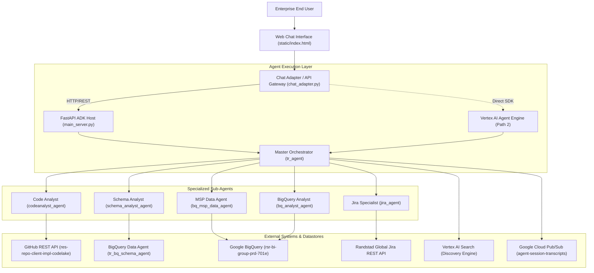

# TalentRadar Agent (`tr_agent`) Documentation

The TalentRadar Agent (`tr_agent`) is an enterprise multi-agent analytics platform built with the Google Agent Development Kit (ADK). The system coordinates specialized autonomous sub-agents to analyze data pipelines, verify schema mappings, query analytical data warehouses, trace GitHub repository source code, and automate Jira engineering operations.

This documentation provides an engineering breakdown of the system components, data flow pipelines, sub-agent contracts, API interfaces, and deployment procedures.

## Documentation Index

The technical documentation suite is organized into five operational documents:

- [System Architecture](file:///c:/Users/abanerjee/Documents/Projects/EDP_Projects/reg-adk-tr-agent/documentation/system_architecture.md): Examines system topography, the master orchestrator, runtime adapters, session persistence, and end-to-end execution sequences.

- [Sub-Agent Specifications](file:///c:/Users/abanerjee/Documents/Projects/EDP_Projects/reg-adk-tr-agent/documentation/subagent_specifications.md): Details input schemas, toolsets, delegation flows, and query conventions for each specialized sub-agent.

- [Data Pipelines and Knowledge Systems](file:///c:/Users/abanerjee/Documents/Projects/EDP_Projects/reg-adk-tr-agent/documentation/data_pipelines_and_rag.md): Covers event telemetry streaming, automated privacy masking with Cloud DLP, analytical data staging in BigQuery, and semantic retrieval through Vertex AI Search.

- [API and Integration Guide](file:///c:/Users/abanerjee/Documents/Projects/EDP_Projects/reg-adk-tr-agent/documentation/api_and_integration_guide.md): Details the dual-server architecture, HTTP endpoint routes, identity proxy authentication, file uploads, and intermediate thought streaming.

- [Operational Runbook](file:///c:/Users/abanerjee/Documents/Projects/EDP_Projects/reg-adk-tr-agent/documentation/operational_runbook.md): Outlines local execution steps, containerization, Vertex AI Agent Platform deployment, environment parameters, safety notices, and disaster recovery.

## High-Level System Context

The platform sits between enterprise users and backend data systems. Users interact via a browser-based chat interface or API clients. The platform coordinates interactions across GitHub codebases, BigQuery analytical datasets, Vertex AI search collections, and Atlassian Jira instances.



## Repository Directory Layout

The codebase maintains a clear separation between sub-agent implementations, web serving layers, background telemetry workers, and operational deployment scripts.

```text
reg-adk-tr-agent/
├── chat_adapter.py              # Flask gateway, session tracker, and web UI endpoints
├── main_server.py               # FastAPI entrypoint mounting ADK tr_agent_app
├── services.py                  # Service registry factory for Vertex AI sessions & memory
├── deploy_agent_engine.py       # Deployment script for Vertex AI Agent Engine
├── create_engine.py             # Provisioning script for Vertex AI Agent Engine instances
├── Dockerfile                   # Python 3.12 container definition
├── start.sh                     # Runtime bootstrap script configuring ports & PYTHONPATH
├── requirements.txt             # Primary Python runtime dependencies
├── static/                      # Web frontend assets (HTML, CSS, JavaScript, icons)
├── process-transcript-stream-cf/# Cloud Function for Pub/Sub transcript DLP anonymization
├── tests/                       # Pytest test suites for Jira tools and model schemas
├── tr_agent/                    # Core ADK agent application package
│   ├── agent.py                 # Root tr_agent definition, tools, and app export
│   ├── models.py                # Pydantic input models and coercion utilities
│   ├── rag_integration.py       # Pub/Sub streaming and Vertex AI Search client
│   ├── file_parser.py           # Multi-format document parser (PDF, Excel, CSV, Images)
│   ├── codeanalyst_agent/       # GitHub SQL repository analyzer
│   ├── schema_analyst_agent/     # BigQuery schema and mapping analyzer
│   ├── bq_msp_data_agent/       # Managed Service Provider analytical querying agent
│   ├── bq_analyst_agent/        # PRS and SLVR table verification agent
│   └── jira_agent/              # Multi-team Jira automation agent
└── documentation/               # Technical documentation suite
```

## Core Architectural Characteristics

The system relies on five distinct architectural patterns to maintain isolation and accuracy:

1. **Structured Input Coercion**: Sub-agents use strict Pydantic schemas. Incoming user follow-up prompts or JSON payloads are normalized into structured model instances before tool execution.

2. **Session and State Isolation**: State is maintained per user and session using `VertexAiSessionService`. Conversation turns are tracked across memory stores without cross-tenant leakage.

3. **Automated Data Protection**: Conversation transcripts are transmitted over Cloud Pub/Sub to a Cloud Function. The function strips identifiers using Cloud DLP prior to saving entries in BigQuery.

4. **Targeted Sub-Agent Delegation**: The root orchestrator classifies user intents and delegates work to isolated sub-agents. Control returns to the root agent to formulate the final answer.

5. **Flexible Execution Environments**: The platform supports local developer execution, containerized Cloud Run deployments, and managed execution inside the Vertex AI Agent Platform.
