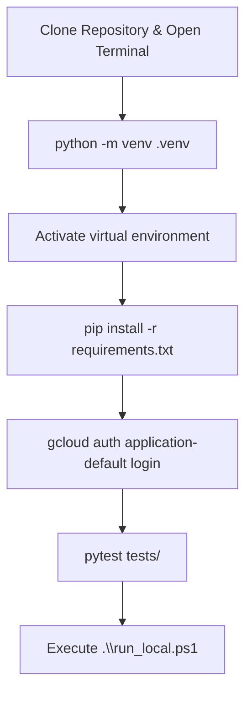
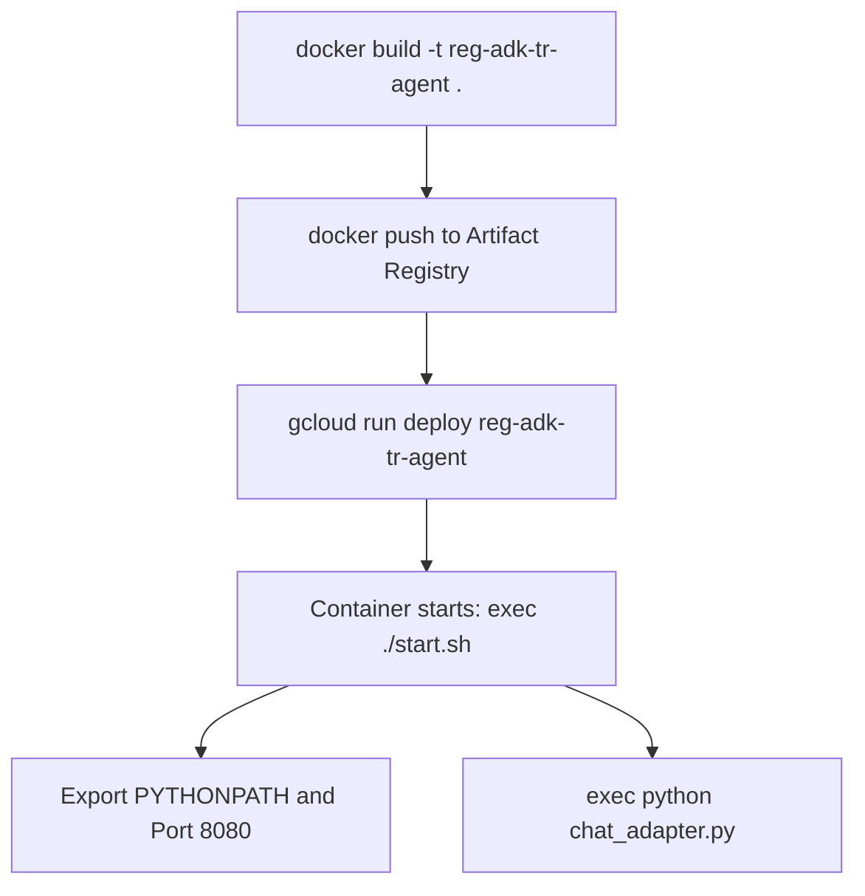
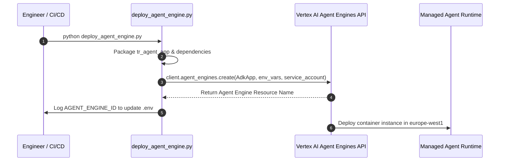

# Operational Runbook and Deployment Guide

The TalentRadar Agent platform operates across local development workstations, containerized Cloud Run runtimes, and managed Vertex AI Agent Platform environments.

This document outlines environment variables, container build steps, deployment workflows, testing protocols, observability configurations, and disaster recovery procedures.

## Environment Configuration Parameters

System behavior is controlled through environment variables loaded at startup.

Variables should be placed in a `.env` file for local development or injected as runtime secret variables in container environments.

| Variable Name | Default Value | Purpose | Required In |
| :--- | :--- | :--- | :--- |
| `GOOGLE_CLOUD_PROJECT` | `rsr-bi-group-dev-c874` | Google Cloud project identifier | All environments |
| `GOOGLE_CLOUD_REGION` | `europe-west1` | Target region for Vertex AI resources | All environments |
| `GOOGLE_APPLICATION_CREDENTIALS` | None | Filesystem path to service account key file | Local / Non-GCP |
| `GITHUB_TOKEN` | None | GitHub Personal Access Token for SQL codelake | Production / CodeAnalyst |
| `JIRA_API_TOKEN` | None | Bearer token for Randstad Global Jira REST API | Production / JiraAgent |
| `JIRA_BASE_URL` | `https://global-jira.randstadservices.com` | Base URL for the corporate Jira instance | Production / JiraAgent |
| `JIRA_SSL_VERIFY` | `True` | Verifies SSL certificates on Jira HTTPS calls | Production / JiraAgent |
| `JIRA_CA_BUNDLE` | None | Path to custom corporate root certificate authority bundle | Enterprise VPN / Proxy |
| `USE_AGENT_ENGINE` | `true` | Routes chat adapter requests to Vertex AI Agent Platform | Cloud Run / Production |
| `AGENT_RUNTIME_ENGINE_ID` | `3643592418449686528` | Vertex AI Agent runtime engine resource ID | Production |
| `PERSISTENT_DATA_ENGINE_ID` | `8063668744527806464` | Agent Engine ID for session and memory persistence | Production |
| `PUBSUB_TOPIC_NAME` | `agent-session-transcripts` | Topic name for streaming conversational telemetry | Telemetry & RAG |
| `VERTEX_SEARCH_PROJECT_ID` | `rsr-bi-group-dev-c874` | Project hosting the Discovery Engine search datastore | Knowledge RAG |
| `VERTEX_SEARCH_ENGINE_ID` | `reg-adk-tr-search_1780537329904` | Discovery Engine search app engine ID | Knowledge RAG |
| `PORT` | `8080` | Network port for the Flask gateway HTTP server | Cloud Run / Local |
| `TEST_USER_EMAIL` | `test.user@randstad.com` | Fallback user email when running without Google IAP | Local Development |
| `GCS_BUCKET_NAME` | `reg-adk-tr-agent-gcs` | Cloud storage bucket for persistent file uploads | Production Uploads |
| `GOOGLE_CLOUD_AGENT_ENGINE_ENABLE_TELEMETRY` | `true` | Enables OpenTelemetry tracing to Cloud Trace | Production |
| `OTEL_SEMCONV_STABILITY_OPT_IN` | `gen_ai_latest_experimental` | Enables GenAI semantic conventions in OpenTelemetry | Observability |
| `OTEL_INSTRUMENTATION_GENAI_CAPTURE_MESSAGE_CONTENT` | `EVENT_ONLY` | Captures message attributes without violating PII policies | Observability |

## Local Development and Verification

Local development requires Python 3.12, an active Google Cloud authentication session, and installed project dependencies.



### Environment Initialization

Follow these steps to configure a local development workstation:

1. Create a Python 3.12 virtual environment:
   ```bash
   python -m venv .venv
   ```

2. Activate the virtual environment:
   ```bash
   # On Windows PowerShell:
   .venv\Scripts\Activate.ps1
   # On Linux / macOS:
   source .venv/bin/activate
   ```

3. Install required runtime dependencies:
   ```bash
   pip install --upgrade pip
   pip install -r requirements.txt
   ```

4. Authenticate your local workstation with Google Cloud:
   ```bash
   gcloud auth application-default login
   gcloud config set project rsr-bi-group-dev-c874
   ```

### Executing Automated Test Suites

The test suite validates input schemas, JQL query builders, and business hours math.

Execute test runs via `pytest`:

```bash
pytest tests/test_jira_agent.py tests/test_model_schemas.py -v
```

The tests verify:

- Dynamic JQL query construction with keyword text operators (`~`).
- Business turnaround math across multi-day spans (08:00 to 16:00, Monday through Friday).
- Input model coercion for plain string prompts, stringified JSON, and structured dictionaries.

### Launching Local Services

To start both the FastAPI host and the Flask gateway locally:

```powershell
.\run_local.ps1
```

Alternatively, launch the services in separate terminal windows:

```bash
# Terminal 1: FastAPI ADK Host
uvicorn main_server:app --port 8000 --reload

# Terminal 2: Flask Chat Adapter
python chat_adapter.py
```

Open `http://localhost:8080` in a web browser to interact with the chat interface.

## Containerization and Cloud Run Deployment

The platform packages as a single container image for deployment to Google Cloud Run.

The build process is defined in the [Dockerfile](file:///c:/Users/abanerjee/Documents/Projects/EDP_Projects/reg-adk-tr-agent/Dockerfile) and bootstrapped via [start.sh](file:///c:/Users/abanerjee/Documents/Projects/EDP_Projects/reg-adk-tr-agent/start.sh).



### Container Startup Script (`start.sh`)

The container entrypoint initializes environment variables and binds to the Cloud Run port:

```bash
#!/bin/bash
export PORT=${PORT:-8080}
export PYTHONPATH=$PYTHONPATH:$(pwd)

export GOOGLE_CLOUD_AGENT_ENGINE_ENABLE_TELEMETRY=${GOOGLE_CLOUD_AGENT_ENGINE_ENABLE_TELEMETRY:-true}
export OTEL_SEMCONV_STABILITY_OPT_IN=${OTEL_SEMCONV_STABILITY_OPT_IN:-gen_ai_latest_experimental}
export OTEL_INSTRUMENTATION_GENAI_CAPTURE_MESSAGE_CONTENT=${OTEL_INSTRUMENTATION_GENAI_CAPTURE_MESSAGE_CONTENT:-EVENT_ONLY}
export USE_AGENT_ENGINE=${USE_AGENT_ENGINE:-true}
export AGENT_RUNTIME_ENGINE_ID=${AGENT_RUNTIME_ENGINE_ID:-3643592418449686528}
export PERSISTENT_DATA_ENGINE_ID=${PERSISTENT_DATA_ENGINE_ID:-8063668744527806464}

exec python chat_adapter.py
```

> [!WARNING]
> HAZARD: Modifying `PYTHONPATH` to include the `tr_agent` subdirectory.
> CONSEQUENCE: Sub-packages will appear as top-level modules. This breaks internal relative package imports (such as `from ..models import CodeAnalystInput`) and prevents the agent from starting.
> MITIGATION: Ensure `PYTHONPATH` includes only the repository root directory: `export PYTHONPATH=$PYTHONPATH:$(pwd)`. Do not append `$(pwd)/tr_agent`.

## Managed Deployment to Vertex AI Agent Platform

The agent can be deployed directly to the Vertex AI Agent Platform as a managed runtime.

The deployment script in [deploy_agent_engine.py](file:///c:/Users/abanerjee/Documents/Projects/EDP_Projects/reg-adk-tr-agent/deploy_agent_engine.py) packages the ADK application using `vertexai.agent_engines.templates.adk.AdkApp`.



### Deployment Execution

Deploy the application to the `europe-west1` region using the dedicated service account:

```bash
python deploy_agent_engine.py
```

The script configures:

- Service Account: `ai-automation@rsr-bi-group-dev-c874.iam.gserviceaccount.com`
- Location: `europe-west1`
- Tracing: Google Cloud Trace export via `opentelemetry-instrumentation-google-genai`
- Persistence: Vertex AI Session Service and Memory Bank Service connections

Upon completion, record the emitted `AGENT_ENGINE_ID` into the `.env` file and Cloud Run environment configuration.

## Safety and Operational Hazard Notices

The platform interacts with corporate ticketing systems and analytical databases. Operators must adhere to the following safety constraints:

> [!CAUTION]
> HAZARD: Bearer token leakage or unauthenticated exposure of port 8080.
> CONSEQUENCE: Unauthorized external users could issue queries against corporate BigQuery tables or modify Jira engineering tickets.
> MITIGATION: Ensure Cloud Run services enforce Google Cloud Identity-Aware Proxy (IAP) or internal IAM authentication. Never commit `.env` files containing raw API tokens to source control.

> [!WARNING]
> HAZARD: Outdated Jira project references during automated ticket creation.
> CONSEQUENCE: Automated tickets will be filed under incorrect team boards, causing missed operational alerts and delayed bug remediation.
> MITIGATION: Operators and agents must confirm the Jira project key (`DET`, `EDP`, `PROJ`, `DATA`) before triggering write actions.

## User Outcome Translation Reference

The table below maps desired operational outcomes to exact commands and system observations:

| Desired Operational Outcome | System Command or Action | Observable Result / Feedback |
| :--- | :--- | :--- |
| Verify unit test health and schema validation | `pytest tests/ -v` | Green test passes for schemas, JQL builder, and business hours math |
| Provision a persistent session Agent Engine | `python create_engine.py` | Terminal displays: `SUCCESS! Your Agent Engine ID is: <engine_id>` |
| Deploy updated agent code to Vertex AI | `python deploy_agent_engine.py` | Terminal outputs deployment operation status and confirms new engine URI |
| Start local dual-server development environment | `.\run_local.ps1` | Web gateway opens on port 8080 and FastAPI starts on port 8000 |
| Verify Jira API connectivity and token health | Agent prompt: "Test Jira connection" | Assistant returns authenticated user profile and corporate endpoint status |
| Inspect data pipeline freshness for client | Agent prompt: "Check freshness for client Siemens" | Agent queries `prs_` and `slvr_` tables, displaying `MAX(rsr_processed_date)` |
| Search historical pipeline resolutions | Agent prompt: "Search history for feed timeout" | Agent calls `search_global_knowledge_base` and returns matching incident summaries |
