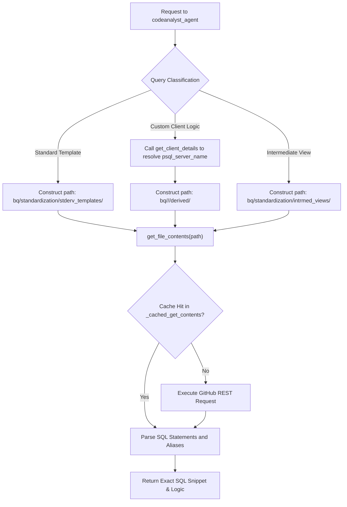
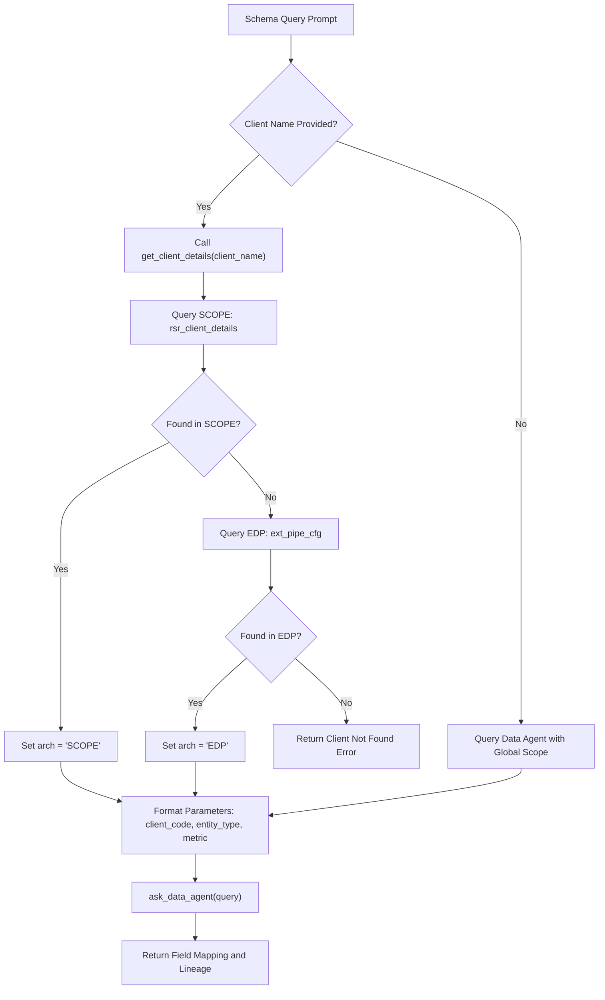
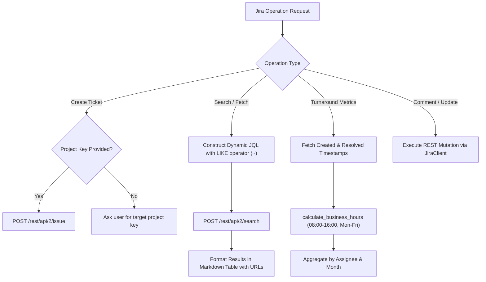

# Sub-Agent Specifications

The TalentRadar Agent platform distributes tasks across five domain-specific autonomous sub-agents. Each sub-agent maintains its own toolset, system instructions, and input validation schemas.

This document defines the operational contracts, execution logic, external toolsets, and query conventions for each sub-agent in the system.

## Sub-Agent Architecture and Contract Matrix

All sub-agents subclass the Google ADK `LlmAgent` or `Agent` class and receive inputs through validated Pydantic models.

The master orchestrator encapsulates each sub-agent within a `SessionAwareAgentTool`. The tool validates input parameters, instantiates a child session, and tracks the execution lifecycle.

| Sub-Agent Name | Module Path | Input Schema | Primary Function | Primary Toolset |
| :--- | :--- | :--- | :--- | :--- |
| `codeanalyst_agent` | `tr_agent.codeanalyst_agent` | `CodeAnalystInput` | SQL repository analysis | GitHub Code Search, Content Retrieval |
| `schema_analyst_agent` | `tr_agent.schema_analyst_agent` | `SchemaAnalystInput` | Field mapping and lineage | BigQuery Data Agent, Client Resolution |
| `bq_msp_data_agent` | `tr_agent.bq_msp_data_agent` | `BQMSPDataInput` | MSP talent dataset analytics | Regional BigQuery Execution, Client Resolver |
| `bq_analyst_agent` | `tr_agent.bq_analyst_agent` | `BQAnalystInput` | PRS and SLVR table inspection | BigQuery Execution, Table ID Resolver |
| `jira_agent` | `tr_agent.jira_agent` | `JiraAgentInput` | Multi-team Jira automation | Jira REST API v2 Client, Turnaround Calculator |

## Code Analyst Agent (`codeanalyst_agent`)

The `codeanalyst_agent` inspects SQL templates, transformation logic, and intermediate views located within the `randstadrisesmart/res-repo-client-impl-codelake` GitHub repository.

The agent parses SQL calculations, explains table joins, and verifies calculation formulas such as business day differences.



### GitHub Tooling and Caching Mechanics

The GitHub integration layer in [tr_agent/codeanalyst_agent/github_tools.py](file:///c:/Users/abanerjee/Documents/Projects/EDP_Projects/reg-adk-tr-agent/tr_agent/codeanalyst_agent/github_tools.py) provides reliable API interaction.

The client mounts an HTTP adapter configured with a `urllib3.util.retry.Retry` strategy. The adapter executes up to three retries on transient HTTP status codes (429, 500, 502, 503, and 504) with an exponential backoff factor of 0.5.

To minimize latency and rate limits, repository requests use `@lru_cache(maxsize=256)`. Both `_cached_search` and `_cached_get_contents` maintain in-memory LRU caches for code searches and file decodings. Base64 file contents are automatically decoded into UTF-8 text strings.

### Code Path Resolution Patterns

The agent applies deterministic file path rules based on the user prompt:

- **Standard Schemas**: Located under `bq/standardization/stderv_templates/<subject_matter>_<source>_template_<entity_type>.sql`.
  - Source abbreviations include `fg` (Fieldglass), `bee` (Beeline), `vn` (Vndly), and `ntv` (Netive).
  - When source is `fg`, the file prefix defaults to `msp_template_<entity_type>.sql`.
  - When subject matter is `rpo`, the path uses `rpo_template_<entity_type>.sql`.

- **Client-Specific Custom Schemas**: Located under `bq/<psql_server_name>/<client_db_name>/derived/`.
  - The agent invokes `get_client_details(client_name)` to determine the target PostgreSQL server name and database name.

- **Intermediate Views**: Located under `bq/standardization/intrmed_views/stdrv_intrmed_<entity_type>_<client_code>.sql`.

### Calculation Logic Conventions

The agent identifies standard transformation functions within SQL scripts:

- `f_workday`: Calculates business days between two dates, excluding weekends.
- `f_calendarday`: Calculates raw calendar days between two dates.
- Field aliasing: The agent detects alias mappings such as `asg_v0.assignment_create_date AS assignment_create_date_initial` to link derived fields back to source tables.

## Schema Analyst Agent (`schema_analyst_agent`)

The `schema_analyst_agent` identifies column mappings between raw vendor extracts and standardized warehouse tables.

The agent translates requests into calls against the managed BigQuery Data Agent `projects/rsr-bi-group-dev-c874/locations/global/dataAgents/tr_bq_schema_agent`.



### Architecture Auto-Detection

The agent resolves client metadata using dual-architecture detection implemented in [tr_agent/schema_analyst_agent/bq_tools.py](file:///c:/Users/abanerjee/Documents/Projects/EDP_Projects/reg-adk-tr-agent/tr_agent/schema_analyst_agent/bq_tools.py).

The function queries legacy SCOPE configuration tables in `rsr-bi-group-prd-701e.db_emea_mysql_configs.rsr_client_details`. If no matching records exist, it queries the EDP pipeline configuration in `rsr-bi-group-dev-c874.dev_reg_edp_epo_configs_eu.ext_pipe_cfg`. The resolved architecture type (`SCOPE` or `EDP`) is returned alongside the `client_code`.

### Field Journey Tracing

The agent maps field lineage across architectural layers:

- **EDP Journey**: Traces `raw_field_name` (source extract) through `slvr_field_name` (silver table) to `gold_field_name` (gold analytical entity).
- **SCOPE Journey**: Traces `raw_field_name` (source extract) through `corrected_field_name` (master layer) to `prs_field_name` (process layer) and `gold_field_name` (standard reporting layer).

## BigQuery MSP Data Agent (`bq_msp_data_agent`)

The `bq_msp_data_agent` translates natural language inquiries into mathematical SQL queries executed against the TalentRadar Blue Data warehouse.

The agent handles analytical metrics covering job requisitions, candidate pipelines, contractor assignments, spend totals, and supplier savings.

### Data Catalog and Regional Routing

All MSP production tables reside in the `rsr-bi-group-prd-701e` Google Cloud project. Datasets are organized by geographic region (`apac`, `emea`, and `nam`).

Table names follow the pattern:
`rsr-bi-group-prd-701e.db_anmz_<region>_<table_type>_stdschema.cnsd_anmz_msp_<region>_<table_type>`

The agent dynamically resolves the target region using the PostgreSQL server name obtained from `get_client_details`:

- `rsr-pod-secure1` routes to region `nam`
- `rsr-pod-secure2` routes to region `emea`
- `rsr-pod-secure3` routes to region `apac`

If a client spans multiple regions or the query lacks a specific client, the agent executes separate queries for each region and synthesizes the comparative results. The system rejects single cross-regional SQL statements.

### Table Schema Matrix

The agent references seven distinct analytical tables:

- `cnsd_anmz_msp_<region>_assignment`: Work orders, start and end dates, bill rates, and supplier details.
- `cnsd_anmz_msp_<region>_assignment_trend`: Historical status changes and monthly assignment distributions.
- `cnsd_anmz_msp_<region>_candidate`: Submissions, interview milestones, rejection reasons, and candidate offers.
- `cnsd_anmz_msp_<region>_requisition`: Job openings, positions counts, budget figures, and job categories.
- `cnsd_anmz_msp_<region>_requisition_distribution`: Supplier broadcast distributions and candidate submission limits.
- `cnsd_anmz_msp_<region>_savings_trend`: Negotiated rate savings, supplier discounts, and cost avoidance metrics.
- `cnsd_anmz_msp_<region>_spend`: Invoiced labor spend, supplier billing amounts, and currency conversions.

### Operational Guardrails and Formatting

The agent operates under explicit execution constraints:

- Manual calculation ban: The agent queries pre-aggregated metrics directly (e.g. `spend_in_usd`) rather than multiplying hourly rates by total hours.
- Mandatory filtering: When a `client_code` is resolved, queries must include `WHERE rsr_client_code = '<client_code>'`.
- Visualizations: When users request charts, the agent outputs a valid Chart.js configuration wrapped in a ````chart```` markdown code fence.
- SQL transparency: Executed queries are always displayed to the user within formatted ````sql```` markdown fences.

## BigQuery Table Analyst (`bq_analyst_agent`)

The `bq_analyst_agent` inspects operational process tables (`prs_`), silver tables (`slvr_`), and standardized gold tables (`stdrv_`).

The agent supports data profiling, row count checks, null rate analysis, duplicate verification, and data pipeline freshness checks.

### Target Table Conventions

The agent constructs table paths based on the client architecture:

- **SCOPE Process Tables**: `rsr-bi-group-prd-701e.<client_db_name>.prs_<entity>_<client_code>` where `<entity>` strips any `_src` suffix.
- **EDP Silver Views**: `rsr-bi-group-prd-701e.slvr_<client_db_name>.v_<table_id>` where `<table_id>` is retrieved from `ext_pipe_cfg`.
- **Standard Gold Tables**: `rsr-bi-group-prd-701e.<client_db_name>.stdrv_<gold_entity>_<client_code>`.

### Data Freshness Verification

Freshness queries check pipeline processing timestamps:

- For SCOPE tables (`prs_` and `stdrv_`), the agent inspects the `MAX(rsr_processed_date)` column.
- For EDP tables (`slvr_`), the agent inspects the `MAX(_batch_timestamp_)` column.

## Jira Automation Agent (`jira_agent`)

The `jira_agent` interacts with the Randstad Global Jira REST API v2 (`https://global-jira.randstadservices.com`).

The agent handles ticket discovery, single and bulk creation, metadata updates, status transitions, comment publication, and engineering turnaround analytics.



### Authentication and Session Resilience

The client in [tr_agent/jira_agent/jira_client.py](file:///c:/Users/abanerjee/Documents/Projects/EDP_Projects/reg-adk-tr-agent/tr_agent/jira_agent/jira_client.py) connects using Bearer token authentication.

It configures an HTTP adapter with retries on status codes 429, 500, 502, 503, and 504. The client supports corporate SSL inspection via the `JIRA_SSL_VERIFY` and `JIRA_CA_BUNDLE` settings.

### Dynamic JQL Filtering Engine

The `_build_jql_query` function generates JQL queries with flexible keyword search:

- Summary search: Uses `summary ~ "<text>"` to perform text containment matching.
- Description search: Uses `description ~ "<text>"` to perform description containment matching.
- Team matching: Evaluates `(Team ~ "<team>" OR "Team[Team]" = "<team>")`.
- Assignee and reporter: Evaluates usernames, account IDs, or `currentUser()`.
- Epic links: Evaluates `("Epic Link" = "<key>" OR parent = "<key>")`.

### Business Hours Turnaround Calculation

The `calculate_jira_turnaround_metrics` tool computes completion speed using corporate business hours.

The algorithm applies the following parameters:

- Standard business hours are 08:00 to 16:00 (8 working hours per day).
- Weekend days (Saturday and Sunday) are excluded.
- Partial days at start and end dates are calculated proportionally.
- Results aggregate total tickets, average business turnaround hours, median turnaround hours, and monthly volume distributions.

### Multi-Team Interaction Protocol

The agent supports multiple engineering groups (such as `DET`, `EDP`, `PROJ`, and `DATA`).

The agent never defaults to a specific project. If a user asks to create a ticket or list open bugs without designating a project, the agent halts and prompts the user to specify the target project key.

## Sub-Agent Transfer Protocol

Control flow between the master orchestrator and sub-agents follows a strict transfer lifecycle.

When a sub-agent completes data collection, it emits its raw findings and transfers control back to `tr_agent`. The master orchestrator synthesizes the answer, cross-references historical knowledge if necessary, and formats the final natural language response for the user.
