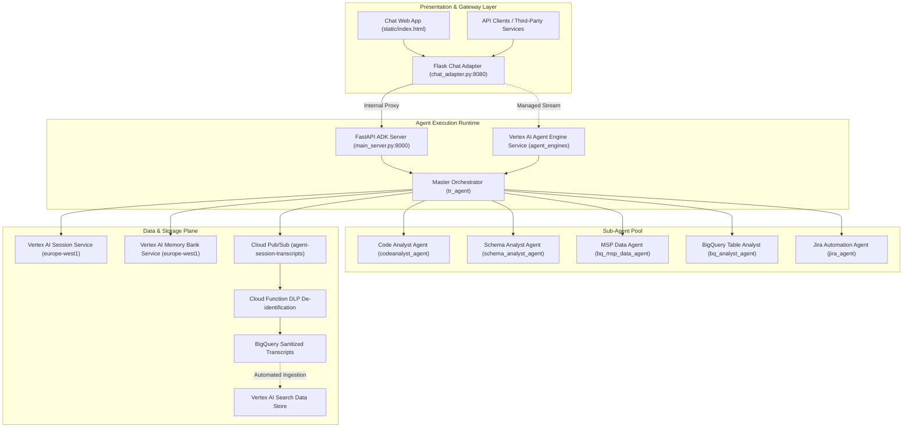
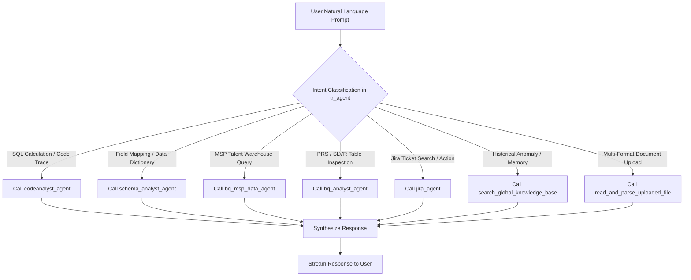
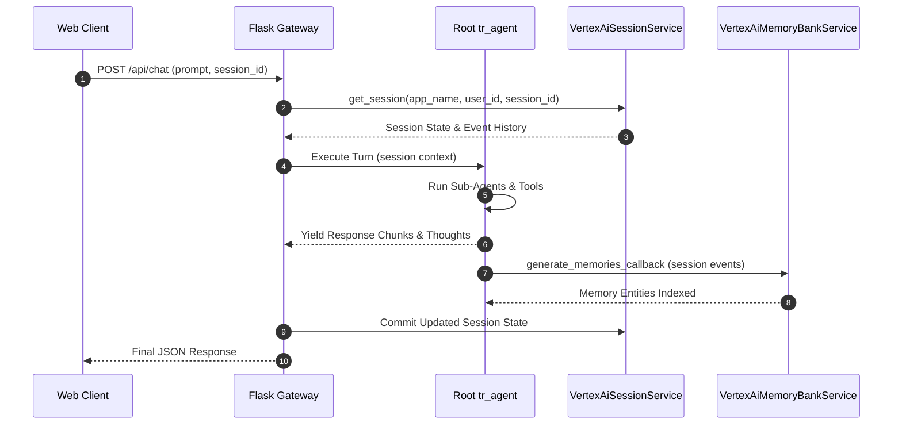
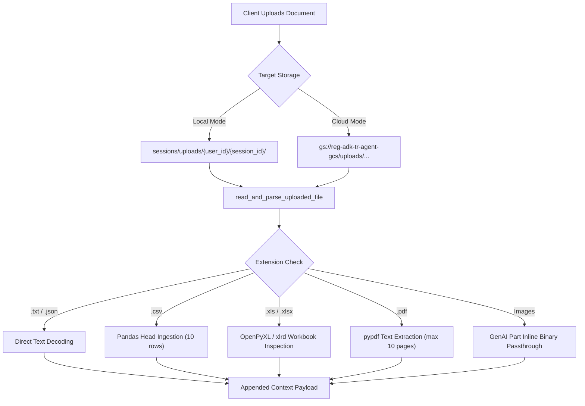

# System Architecture

The TalentRadar Agent platform coordinates five domain-specific autonomous sub-agents under a master orchestrator. The architecture provides natural language querying of data engineering logic, automated Jira ticket manipulation, BigQuery data verification, and secure session transcript indexing.

This document describes the software layers, execution components, persistence engines, and communication sequences implemented across the platform.

## High-Level Architectural Topography

The platform operates across three functional layers: the presentation and gateway layer, the agent execution runtime, and external enterprise datastores.

The presentation gateway accepts HTTP requests from client applications and forwards payloads to the agent runtime. The agent runtime evaluates intent and coordinates execution across the sub-agents. External systems supply metadata, query execution engines, code repositories, and ticket tracking backends.

## Presentation and Gateway Layer

The presentation layer handles connection management, client identity extraction, file uploads, and intermediate reasoning capture.

The application serves static web assets through a Flask application defined in [chat_adapter.py](file:///c:/Users/abanerjee/Documents/Projects/EDP_Projects/reg-adk-tr-agent/chat_adapter.py). It exposes endpoints for real-time chat streaming, session management, file retrieval, and user profile resolution.

### Identity Extraction and User Scoping

Authentication relies on Google Identity-Aware Proxy headers or local development fallbacks.

The gateway inspects incoming requests for the `X-Goog-Authenticated-User-Email` header. If present, the gateway extracts the verified email address and strips account namespace prefixes. If absent, the gateway defaults to the `TEST_USER_EMAIL` environment variable.

The email string is converted into a storage key by substituting `@` and `.` characters with hyphenated delimiters. This sanitized key acts as the user identifier across Vertex AI sessions and Google Cloud Storage buckets.

### In-Flight Session State Tracking

Real-time reasoning steps and tool execution outputs are monitored through an in-memory session tracker.

The `ActiveSessionTracker` class in [chat_adapter.py](file:///c:/Users/abanerjee/Documents/Projects/EDP_Projects/reg-adk-tr-agent/chat_adapter.py) maintains a thread-safe dictionary of active sessions. Each session entry tracks current status, elapsed execution time, intermediate thoughts, and accumulated text fragments.

When the agent executes tools or delegates tasks to sub-agents, the tracker collects these events into an event stream. If a session fails to emit updates within 900 seconds, the tracker flags the session as timed out to prevent resource exhaustion.

## Master Orchestrator Architecture

The central controller is the root `tr_agent` instance defined in [tr_agent/agent.py](file:///c:/Users/abanerjee/Documents/Projects/EDP_Projects/reg-adk-tr-agent/tr_agent/agent.py).

The orchestrator receives natural language input, evaluates the user intent, and delegates tasks to specialized sub-agents. It wraps each sub-agent within a `SessionAwareAgentTool` to preserve session context during transitions.

### Routing Rules and Decision Paths

The master orchestrator evaluates inputs against predefined functional paths:

- **Path A (Code Analysis)**: Questions regarding field derivations, SQL templates, or GitHub logic route to `codeanalyst_agent`.

- **Path B (Schema Mapping)**: Inquiries about field mappings, source-to-target translations, or data dictionaries route to `schema_analyst_agent`.

- **Path C (Full Lineage Pipeline)**: Requests tracing a derived field back to its raw source follow a sequential chain. The orchestrator calls `codeanalyst_agent` to extract calculation logic, then passes the underlying entity to `schema_analyst_agent` to locate raw fields.

- **Path D (MSP Talent Data)**: Analytical queries on requisitions, assignments, candidates, spend, and savings route to `bq_msp_data_agent`.

- **Path E (BigQuery Table Inspection)**: Profiling, duplicate verification, and freshness checks on `prs_` and `slvr_` datasets route to `bq_analyst_agent`.

- **Path F (Contextual Follow-ups)**: Follow-up turns inherit the active sub-agent from the previous turn unless a domain shift occurs.

- **Path G (File Ingestion)**: Attached files trigger `read_and_parse_uploaded_file` prior to agent routing.

- **Path H (Jira Operations)**: Ticket searches, issue creation, comments, and turnaround metrics route to `jira_agent`.

### Session-Aware Tool Delegation

Sub-agents execute through an isolated tool execution wrapper.

The `SessionAwareAgentTool` class converts an ADK sub-agent into an executable tool callable by the root orchestrator. During invocation, it extracts the `user_id` and `session_id` from the active tool context and executes the sub-agent against an isolated child session.

Events emitted by the child agent are captured, tagged, and recorded in the parent session state under `temp:_sub_agent_trace_<agent_name>`. This architecture maintains complete conversation histories while presenting clean status traces in the user interface.

## Session and Memory Persistence

State persistence across user sessions relies on Google Cloud Vertex AI infrastructure.

The platform registers custom factory functions in [services.py](file:///c:/Users/abanerjee/Documents/Projects/EDP_Projects/reg-adk-tr-agent/services.py) with the ADK global service registry. These factories bind URI schemes to managed services.

### Vertex AI Session Service

Session state is persisted remotely rather than stored on local disks.

The `VertexAiSessionService` connects to a persistent Agent Engine instance in the `europe-west1` region. It stores serialized turn events, sub-agent invocation states, and file upload references. This mechanism allows stateless web servers to scale horizontally without session loss.

### Vertex AI Memory Bank Service

Long-term episodic memories are indexed through the Memory Bank service.

At the conclusion of each conversation turn, the `generate_memories_callback` function triggers. It submits turn events to the Memory Bank API, which extracts entities, user preferences, and client associations. When a user asks historical questions, the orchestrator retrieves these indexed memories.

## Asynchronous Data Sanitization and Knowledge RAG

The platform implements an automated feedback loop that captures agent conversations, strips sensitive information, and indexes clean transcripts for future retrieval.

```mermaid
flowchart LR
    TurnEnd["Agent Turn Concludes"] --> PubSubMsg["stream_to_global_rag_pipeline"]
    PubSubMsg --> Topic["Pub/Sub: agent-session-transcripts"]
    Topic --> CloudFunc["Cloud Function: process-transcript-stream-cf"]
    
    subgraph PrivacyFilter["Privacy Scrubbing"]
        CloudFunc --> DLP["Cloud DLP deidentify_content"]
        DLP --> BQInsert["BigQuery Streaming Insert"]
    end

    BQInsert --> BQTable["reg_adk_tr_agent_knowledge.sanitized_transcripts"]
    BQTable --> SearchIndex["Vertex AI Search Engine"]
    SearchIndex --> QueryTool["search_global_knowledge_base"]
```

### Telemetry Streaming

Completed turns emit background telemetry messages.

The `stream_to_global_rag_pipeline` callback in [tr_agent/rag_integration.py](file:///c:/Users/abanerjee/Documents/Projects/EDP_Projects/reg-adk-tr-agent/tr_agent/rag_integration.py) executes asynchronously after each agent invocation. It compiles the turn prompt, model response, tool execution logs, and active client code into a JSON payload. This payload is published to the `agent-session-transcripts` Google Cloud Pub/Sub topic.

### Privacy Scrubbing with Cloud DLP

Personal identifying data is filtered before long-term storage.

The [process-transcript-stream-cf/main.py](file:///c:/Users/abanerjee/Documents/Projects/EDP_Projects/reg-adk-tr-agent/process-transcript-stream-cf/main.py) Cloud Function triggers on incoming Pub/Sub messages. It sends transcript text to the Google Cloud Data Loss Prevention API. The DLP inspects content against `PERSON_NAME`, `EMAIL_ADDRESS`, and `PHONE_NUMBER` infoTypes.

Detected identifiers are replaced with generic surrogate markers. The function inserts the sanitized record into the `reg_adk_tr_agent_knowledge.sanitized_transcripts` BigQuery table.

### Semantic Knowledge Retrieval

Historical system context is accessible via semantic search.

The `search_global_knowledge_base` function uses the Google Cloud Discovery Engine client. It queries the `default_search` serving configuration across indexed transcripts. Returned snippets provide historical context on schema migrations, pipeline anomalies, and past resolution steps.

## File Ingestion and Document Parsing

The agent accepts document attachments to support document-assisted analysis.

File uploads are handled by [tr_agent/file_parser.py](file:///c:/Users/abanerjee/Documents/Projects/EDP_Projects/reg-adk-tr-agent/tr_agent/file_parser.py). The parser supports text documents, JSON files, delimited CSV files, Excel spreadsheets, PDF files, and image formats.

Spreadsheets and tabular files are converted into structured Markdown summaries. Text and PDF files are truncated after configured character thresholds to preserve model context limits. Images are encoded as base64 byte streams and passed directly as native multimodal content parts.
