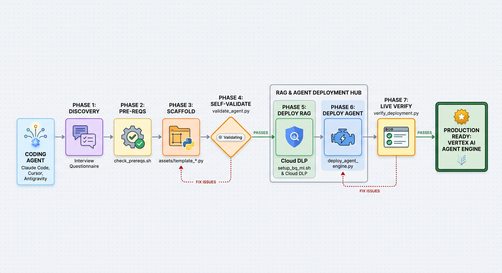

# GCP Enterprise Agentic RAG Skill

> Standardized, serverless multi-agent RAG framework on Google Cloud Platform.

This skill equips coding agents to scaffold, configure, validate, and deploy enterprise multi-agent systems on Vertex AI Agent Runtime with persistent memory banks, Cloud DLP privacy redaction, BigQuery ML summarization, and Vertex AI Search.



## Overview

Building production-grade agent systems involves significant infrastructure and integration overhead: selecting orchestrators and models, managing session and cross-session memory, masking PII, wiring RAG pipelines, configuring telemetry, and managing deployments.

This skill automates that boilerplate using proven enterprise multi-agent patterns on Google Cloud Platform, letting you focus on domain logic and tool implementation.

## Workflow

The skill automates the complete lifecycle in eight structured phases:

1. **Requirements Discovery**: Collects application scope, sub-agent roles, tool requirements, GCP project details, and target regions.
2. **Prerequisites & IAM**: Verifies and enables GCP APIs, creates dedicated service accounts, and binds least-privilege IAM roles.
3. **Codebase Scaffolding**: Generates Google ADK multi-agent structures with root orchestration, sub-agents, and session/memory service builders.
4. **Pre-Deployment Validation**: Runs local static and behavioral checks against the generated code before provisioning cloud resources.
5. **RAG & Privacy Pipeline**: Sets up streaming telemetry via Pub/Sub, Cloud DLP de-identification, BigQuery ML summarization models, and Vertex AI Search data stores.
6. **Agent Engine Deployment**: Deploys the multi-agent package to Vertex AI Agent Runtime with OpenTelemetry Cloud Trace integration.
7. **Post-Deployment Verification**: Runs live queries against the deployed runtime to confirm routing, memory retention, and telemetry.
8. **Documentation**: Produces a root `README.md` with system architecture diagrams, environment configurations, and GCP Console Playground instructions.

## Installation via `skills.sh` / `npx`

This skill is compatible with the [skills.sh](https://skills.sh) registry and can be installed into any workspace using the Skills CLI:

### 1. Install from GitHub Repository

```bash
npx skills add https://github.com/baner29/agent_skills --skill gcp-enterprise-agentic-rag
```

### 2. Install from Tree URL

```bash
npx skills add https://github.com/baner29/agent_skills/tree/main/.agents/skills/gcp-enterprise-agentic-rag
```

### 3. Install for Specific Agents

```bash
# Install to Claude Code and Cursor
npx skills add https://github.com/baner29/agent_skills --skill gcp-enterprise-agentic-rag --agent claude-code cursor

# Install globally across all projects
npx skills add https://github.com/baner29/agent_skills --skill gcp-enterprise-agentic-rag -g
```

---

## Directory Structure

```text
gcp-enterprise-agentic-rag/
├── SKILL.md                 # Core instructions, checklist & pointers (<150 lines)
├── README.md                # Skill overview, design diagrams & npx installation instructions
├── references/              # On-demand technical documentation (loaded when needed)
│   ├── discovery.md         # Phase 1: Requirements interview questionnaire
│   ├── prerequisites.md     # Phase 2: GCP APIs, IAM least-privilege roles, MCP tools
│   ├── architecture.md      # Phase 3: Code layout, ADK state builders, root_agent wiring
│   ├── rag_pipeline.md      # Phase 5: Pub/Sub, Cloud DLP, BigQuery ML remote model, Discovery Engine
│   ├── agent_runtime.md     # Phase 6: Vertex AI Agent Engine setup, AdkApp deployment
│   ├── gotchas.md           # Critical edge cases, workarounds, and telemetry flags
│   └── documentation.md     # Phase 8: Application documentation & GCP Playground testing guide
├── scripts/                 # Self-contained validation and automation scripts
│   ├── check_prereqs.sh     # Infrastructure pre-requisites verification
│   ├── setup_bq_ml.sh       # BigQuery ML & Cloud Resource Connection automated setup
│   ├── setup_vertex_search.py # Vertex AI Search Data Store & Search App setup
│   ├── validate_agent.py    # Pre-deployment codebase self-validation loop
│   └── verify_deployment.py # Post-deployment live GCP self-validation
└── assets/                  # Starter code templates
    ├── template_agent.py    # Orchestrator & sub-agent starter template
    ├── template_deploy.py   # Agent Runtime deployment template
    └── template_cf_main.py  # Cloud Function Gen 2 with Cloud DLP sanitization
```
