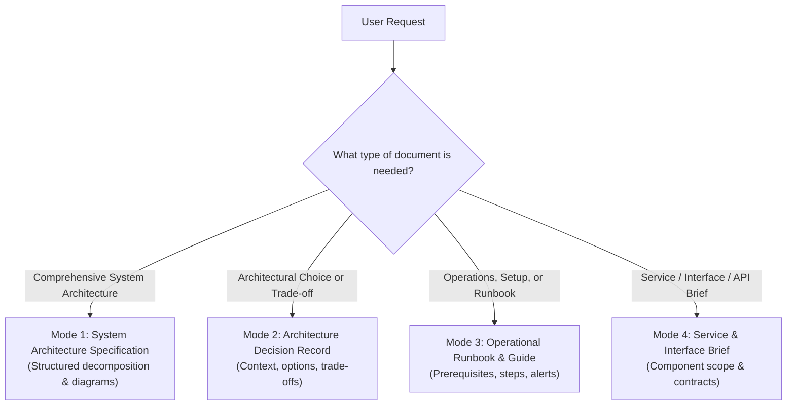

# Scribeme: Human-Readable Technical Documentation Architect

This skill equips coding agents to produce rigorous, human-readable, maintainable technical documentation. It eliminates walls of impenetrable jargon, academic meta-chatter, and generic AI filler by applying international documentation standards, proven architectural templates, and plain language principles.

---

## 1. Cardinal Guardrails: Invisible Scaffolding & Anti-AI Writing

To ensure documentation reads as if authored by a staff software architect or principal SRE—rather than an AI language model—strictly enforce these two cardinal rules:

### Rule A: Invisible Scaffolding (Zero Meta-Framework & Standard Quoting)
**Internal standards and frameworks are cognitive tools for the AI agent, NOT text to quote in output documents.**
- ❌ **NEVER cite internal standards or framework names in the generated document**: Do not write *"Follows the Lean arc42 framework"*, *"C4 Model Level 2 Container Diagram"*, *"Operational runbook conforming to IEC/IEEE 82079-1 and ISO 20607 safety standards"*, *"Executive Y-Statement"*, or *"In compliance with ISO/IEC/IEEE 15289"*.
- ✅ **Use natural engineering headings**:
  - Instead of `arc42 Section 5: Building Block View (C4 Level 2 Container Diagram)`, write `System Architecture` or `Component Breakdown`.
  - Instead of `Runtime View according to arc42 Section 6`, write `Transaction Lifecycle` or `End-to-End Sequence Flow`.
  - Instead of `Executive Y-Statement`, write `Decision Summary` or integrate the statement directly under `Decision Outcome`.
  - Instead of citing `IEC/IEEE 82079-1`, simply structure procedures into `Prerequisites`, `Step-by-Step Procedure`, and `Verification`.
  - Instead of citing `ISO 20607`, simply use GitHub markdown alert boxes (`> [!CAUTION]`, `> [!WARNING]`).

### Rule B: Elimination of AI Writing Markers (Wikipedia Signs of AI Writing)
Guard against the statistical hallmarks of LLM-generated prose ([Wikipedia:Signs of AI writing](https://en.wikipedia.org/wiki/Wikipedia:Signs_of_AI_writing)):
1. **No Superficial Commentary (Trailing `-ing` Participle Fluff)**:
   - ❌ *"The cache stores query results for 5 minutes, ensuring rapid data retrieval and elevating user satisfaction."*
   - ✅ *"The cache stores query results for 5 minutes (TTL = 300s)."*
   - Ban trailing participial commentary: *ensuring, highlighting, underscoring, emphasizing, reflecting, symbolizing, cultivating, fostering, enhancing, contributing to*.
2. **No Undue Significance & Grand Legacy Puffery**:
   - ❌ *"This service stands as a testament to modern engineering, marking a pivotal moment in our evolving architectural landscape."*
   - ✅ *"This service handles card authorizations with under 200ms P99 latency."*
   - Ban puffery words: *stands as a testament to*, *serves as a reminder*, *pivotal role / pivotal moment*, *in today's rapidly evolving landscape*, *crucial milestone*, *watershed moment*, *beacon of*, *transformative shift*.
3. **No "Rule of Threes" Adjective Stacking**:
   - ❌ *"Provides a robust, scalable, and resilient foundation for our services."*
   - ✅ *"Sustains 10,000 req/sec across 3 availability zones."*
4. **No Robotic Sentence-Initial Transition Spam**:
   - Avoid repetitive transition adverbs starting sentences: *Additionally, ...*, *Furthermore, ...*, *Notably, ...*, *Consequently, ...*, *Ultimately, ...*, *In conclusion, ...*.
5. **No Thesaurus Inflation**:
   - Use plain, direct verbs: *use* (not *utilize*), *start* (not *commence*), *build* (not *architect as a verb*), *show* (not *delineate*), *try* (not *attempt*).
6. **No Conversational AI Leavings**:
   - Never output chatbot preambles (*"Certainly! Below is the documentation..."*) or postscripts (*"I hope this helps! Let me know if..."*). Output ONLY the raw markdown document.

### Rule C: Zero Methodology Meta-Text & Prompt Reflection (Pure Subject-Matter Focus)
**Never describe how the document was generated, what tools were used, how source code was inspected, or how prompt instructions were fulfilled.**
- ❌ **NEVER write methodology disclaimers, research narratives, or source-of-truth declarations**:
  - *"This documentation suite reflects the system implementation directly from the source code."*
  - *"All configuration values, API contracts, database schemas, and operational parameters correspond to active production code."*
  - *"This document was generated based on the codebase analysis..."*
  - *"As requested, this document provides..."*
  - *"The following specifications have been derived from inspecting repository files..."*
  - *"In accordance with your instructions..."*
- ❌ **Why this fails**: Human software engineers at top tech companies never write meta-commentary about how they wrote their documentation or swear that their values match production code. They simply state the facts, architecture, and contracts directly. Stating that docs "reflect source code" is an immediate AI fingerprint.
- ✅ **Rule of Pure Subject-Matter Focus**: Every single sentence in the document MUST describe the system itself—its domain, components, interfaces, operational procedures, or trade-offs. If a sentence describes *the documentation process*, *the author's research method*, or *prompt adherence*, **DELETE IT ENTIRELY**.

### Rule D: Dedicated Storage Directory (`documentation/`)
**Always store documentation inside a `documentation/` folder in the active workspace path, or as explicitly suggested/requested by the user.**
- ❌ **NEVER dump documentation files in the project root directory**
- ✅ **Standard Subdirectory Structure**:
  - `documentation/`
- ✅ **User Preference Priority**: If the user explicitly requests an alternative directory or naming convention (e.g., `docs/`, `wiki/`, or a custom path), follow the user's specification. If not specified, default strictly to `documentation/`. Ensure the directory is created if it does not exist.

---

## 2. Quick-Start Triage & Mode Selection

Route requests to the appropriate blueprint without leaking framework terminology into titles:



| Mode | Target Artifact | Internal Mental Model | Reference Guide |
|---|---|---|---|
| **Mode 1** | System Architecture Spec | Lean arc42 + C4 Context & Container | [references/arc42_lean_guide.md](references/arc42_lean_guide.md) |
| **Mode 2** | Architecture Decision Record (ADR) | MADR 3.0 + Y-statement trade-off logic | [references/adr_framework.md](references/adr_framework.md) |
| **Mode 3** | Operational Runbook / SOP | IEC/IEEE 82079-1 task schema + ISO 20607 hazard alerts | [references/standards_compliance.md](references/standards_compliance.md) |
| **Mode 4** | Service & Interface Brief | C4 Component + Outcome translation | [references/best_practices_audience.md](references/best_practices_audience.md) |

---

## 3. Universal Documentation Workflow

Follow this six-step execution pipeline for every document:

### Step 1: Establish Storage Location & Audience
1. **Target Folder**: Determine the output file path. Store the document inside a `documentation/` folder in the active path (e.g. `documentation/`), or in the custom path suggested by the user. Ensure the directory is created if it does not already exist.
2. **Audience & Angles**: Determine who will read the document. Apply the 3-Angle View Framework from [references/best_practices_audience.md](references/best_practices_audience.md):
   - **Conceptual View** (PM, UX, Leadership): Focus on business goals, user personas, and capabilities.
   - **Component View** (Frontend, Integrators, IT): Focus on APIs, boundaries, and sync vs. async flows.
   - **Operational View** (DevOps, SRE, Backend): Focus on infrastructure, scaling, recovery, and security.

### Step 2: Separate Information Types
Structure content cleanly by type without citing the standard:
- **Concept**: Explain system purpose, mental models, and architectural boundaries.
- **Task**: Provide numbered, imperative step-by-step procedures with prerequisites and verification.
- **Reference**: Present factual parameter tables, configuration schemas, and error codes.

### Step 3: Embed Native Mermaid Diagrams-as-Code
Never use placeholder links or static images. Generate pure Mermaid blocks using templates in [references/c4_diagramming.md](references/c4_diagramming.md):
- Include a **System Context Diagram** for cross-functional scope.
- Include a **Container Diagram** for deployable architecture.
- Include a **Sequence Diagram** with numbered steps (`autonumber`) for critical transaction flows.
- Label nodes with names and roles; label relationship arrows with action verbs and protocols.

### Step 4: Translate Tech into User-Relevant Outcomes
Translate raw technical constraints into user impact using an Outcome Translation Table:
```markdown
| Requirement | Technical Implementation | User & Business Outcome |
|---|---|---|
| Scalability | Kubernetes HPA (CPU > 70%) | System absorbs 10x traffic surges with 0% dropped transactions. |
| Performance | Redis in-memory caching | Product detail pages load in under 200ms globally. |
```

### Step 5: Enforce Safety Signals & Anti-AI Polish
- Map hazards to standard markdown alerts from [references/standards_compliance.md](references/standards_compliance.md):
  - `> [!CAUTION]` for **DANGER** (irreversible data loss or system crash).
  - `> [!WARNING]` for **WARNING** (downtime, credential exposure, corruption).
  - `> [!NOTE]` for **NOTICE** (configuration tips, conventions).
- Run the **Anti-AI Writing Polish**:
  - **Purge Methodology Meta-Text**: Delete any sentences describing how the document was generated, what repository files were analyzed, or affirming that the documentation reflects active production code.
  - Strip trailing `-ing` participial fluff.
  - Delete puffery adjectives and grand legacy declarations.
  - Convert passive verbs to active voice with named software actors (`"OrderService publishes..."` not `"An event is published..."`).
  - Keep paragraphs under 4 sentences for scannability.

### Step 6: Validate Document
Run the automated validation linter to verify syntax, diagram balance, alert formatting, and absence of AI markers or methodology text:
```bash
# If invoked from workspace repository:
python .agents/skills/scribeme/scripts/doc_validator.py path/to/document.md --strict

# Or from global installation:
python ~/.gemini/config/skills/scribeme/scripts/doc_validator.py path/to/document.md --strict
```

---

## 4. Mode Blueprints (Natural Headings)

### Mode 1: System Architecture Specification
Structure comprehensive system architecture documents with natural industry headings (consult [references/arc42_lean_guide.md](references/arc42_lean_guide.md)):
1. **Introduction & Goals**: Problem statement, top 3 quantifiable quality goals, and stakeholder matrix.
2. **Architecture Constraints**: Hard technical, organizational, and regulatory constraints.
3. **System Context & Boundaries**: External system integrations and user personas with a **System Context Diagram**.
4. **Solution Strategy**: High-level paradigm (event-driven, microservices) and storage strategy.
5. **System Architecture & Containers**: Subsystem breakdown with a **Container Diagram**.
6. **Transaction Flow (Runtime)**: Key scenarios illustrated via **Sequence Diagrams**.
7. **Deployment & Infrastructure**: Cloud infrastructure topology (compute, network, persistence).
8. **Crosscutting Concepts**: Security (OAuth/JWT), Observability (OpenTelemetry), and Resilience.
9. **Architecture Decisions**: Table indexing active decisions.
10. **Quality Requirements**: Quality tree with quantifiable stimulus-response scenarios.
11. **Risks & Mitigations**: Risk matrix with concrete mitigations.
12. **Glossary**: Ubiquitous domain and technical terminology.

### Mode 2: Architecture Decision Record (ADR)
When documenting an architectural choice, use the clean format from [references/adr_framework.md](references/adr_framework.md):
1. **Title & Metadata**: `ADR-[ID]: [Title]`, Status (`Proposed`, `Accepted`, `Deprecated`), Date, Deciders.
2. **Context & Problem Statement**: 1–2 paragraphs framing what changed and why a choice is required.
3. **Decision Drivers**: 3–5 bulleted constraints (latency SLA, operational cost, compliance).
4. **Considered Options**: Bulleted list of evaluated options.
5. **Decision Outcome**: Selected option with a concise rationale incorporating the decision formula:
   > *"In the context of [context], facing [driver], we decided for [option], to achieve [benefit], accepting [trade-off]."*
6. **Trade-off Analysis Matrix**: Comparative table evaluating options across criteria.
7. **Consequences & Mitigations**: Positive results and operational mitigations for negative trade-offs.

### Mode 3: Operational Runbook & Guide
When authoring runbooks, setup instructions, or user guides (see [references/standards_compliance.md](references/standards_compliance.md)):
1. **Audience & Purpose**: Explicitly state required skill level and intended outcome.
2. **Prerequisites**: Clear checklist of permissions, CLI tools, and environment variables.
3. **Safety Notices**: Prominently display hazard alerts before risky operations.
4. **Step-by-Step Procedure**:
   - Numbered imperative steps (e.g., "1. Run `terraform apply`").
   - Explicit code snippets with expected stdout/stderr output.
5. **Verification & Health Check**: Measurable command to confirm success (e.g., `curl -f http://localhost:8080/health`).
6. **Rollback & Troubleshooting**: Table mapping common error symptoms to root causes and fixes.

### Mode 4: Service & Interface Brief
When documenting an individual microservice, API, or integration boundary:
1. **Service Scope**: Role within the wider ecosystem with an internal component diagram.
2. **API & Interface Contract**: REST endpoints, gRPC protos, or event schemas.
3. **Synchronous vs. Asynchronous Dynamics**: Latency expectations and consistency models.
4. **Outcome Translation Table**: Mapping technical SLAs to user experience.

---

## 5. Verification & Completion Checklist

Before finalizing any technical documentation, verify every item on this checklist:

- [ ] **Document Storage Location (`documentation/`)**: The document is stored within the `documentation/` folder in the active path, or in the custom path explicitly requested by the user. It is NEVER placed directly in the repository root.
- [ ] **Pure Subject-Matter Focus (Zero Methodology Meta-Text)**:
  - Check that the document contains **ZERO** sentences describing how it was generated, what repository files were analyzed, or where data came from.
  - Check that there are **NO** sentences like:
    - *"This documentation suite reflects the system implementation directly from the source code."*
    - *"All configuration values, API contracts, database schemas, and operational parameters correspond to active production code."*
    - *"This document was generated based on the codebase analysis..."*
    - *"As requested, this document provides..."*
    - *"In accordance with your instructions..."*
  - Every single sentence describes the software system, never the documentation process or prompt instructions.
- [ ] **Zero Meta-Framework / Standard Quoting**: No mentions of "arc42", "C4 Model", "Level 1/2/3", "IEC/IEEE 82079-1", "ISO 20607", "ISO 15289", "ISO 24495", "MADR", or "Y-statement formula".
- [ ] **No Superficial AI Commentary**: Zero trailing `-ing` clauses (*ensuring*, *highlighting*, *fostering*, *enhancing*).
- [ ] **No Significance / Legacy Puffs**: Zero buzzwords (*stands as a testament*, *pivotal role*, *evolving landscape*, *watershed moment*).
- [ ] **No Rule-of-Threes Adjective Stacking**: Concrete metrics used instead of generic triples (*"robust, scalable, and resilient"*).
- [ ] **No Chatbot Meta-Text**: No conversational opening/closing remarks. Output begins directly with `# Document Title`.
- [ ] **Native Diagrams-as-Code**: All diagrams use valid Mermaid codeblocks (` ```mermaid `) with labeled nodes and relation verbs. No static images.
- [ ] **Outcome Translation Included**: Technical requirements are paired with user and business impact.
- [ ] **Safety Alerts Validated**: Critical hazards use `> [!WARNING]` or `> [!CAUTION]` with hazard type, consequence, and required action.
- [ ] **Validator Script Passed**: Executed `doc_validator.py --strict` with zero errors and zero warnings.
