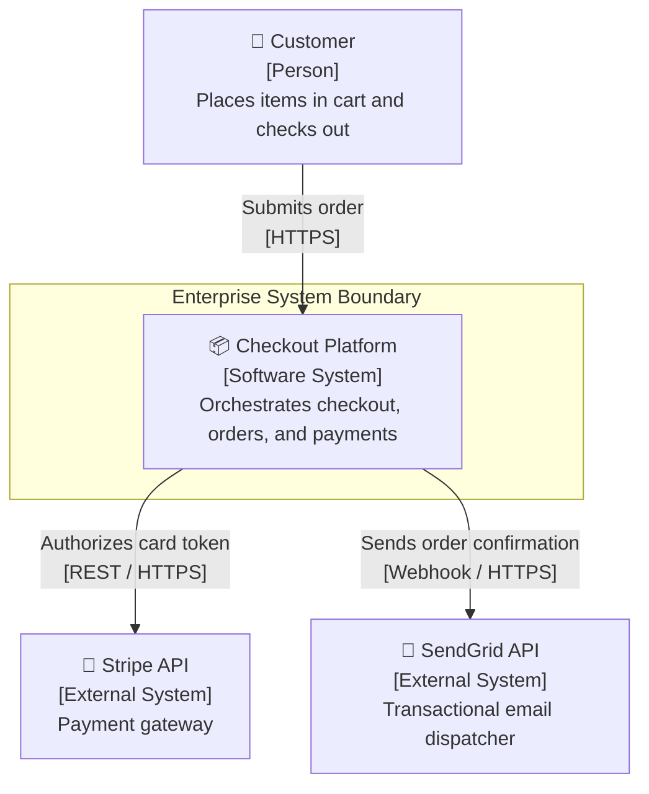
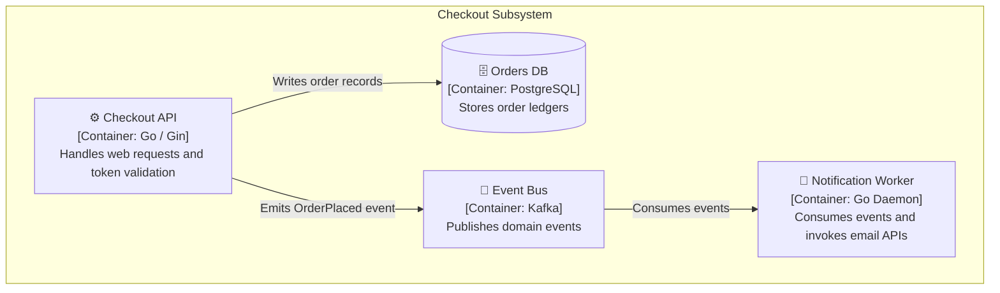
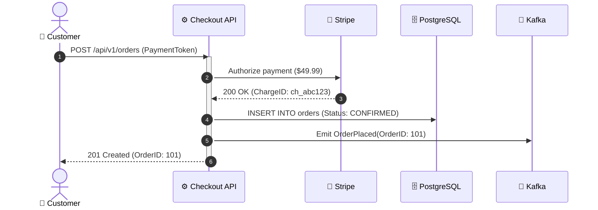

# System Architecture Specification: Distributed Checkout Platform

This document specifies the technical architecture, domain boundaries, and transaction flows for the Distributed Checkout Platform.

## 1. Introduction and Goals
The Distributed Checkout Platform coordinates payment processing, customer order capture, and transactional notifications during peak commercial events.

### Top Quality Goals
1. **P99 Latency < 250ms**: End-to-end checkout processing time under peak load.
2. **Availability 99.95%**: Uninterrupted checkout capability across multi-region deployments.
3. **Auditability**: Complete end-to-end trace logs for every financial transaction.

### Stakeholder Requirements
| Stakeholder | Concern | Architectural Expectation |
|---|---|---|
| Product Manager | High conversion rate | Low cart abandonment from slow processing |
| Security Officer | PCI-DSS compliance | Tokenized payment processing with zero raw PAN storage |
| SRE Lead | System resilience | Self-healing pods with circuit breakers |

## 2. Architecture Constraints
- **Cloud Platform**: Google Cloud Platform (Cloud Run & Cloud SQL).
- **Compliance**: PCI-DSS Level 1 compliance; no cardholder data touches application memory.
- **Language Stack**: Go 1.22 for low-latency backend microservices.

## 3. Context and Scope
The system interfaces with shoppers on the web, internal fraud detection, Stripe for payment authorization, and SendGrid for transactional emails.

## 4. Solution Strategy
- **Decoupled Asynchronous Processing**: Orders are authorized synchronously, but fulfillment and notification dispatch occur asynchronously via event streams.
- **Transactional Outbox**: Guaranteed event delivery using transactional outbox pattern to prevent split-brain states between the database and event bus.

## 5. Building Block View
Decomposition into container building blocks:

## 6. Runtime View
The following sequence diagram details the checkout sequence:

## 7. Deployment View
Deployed across 3 GCP zones using serverless Cloud Run instances connected to a Cloud SQL High Availability PostgreSQL cluster via private VPC peering.

## 8. Crosscutting Concepts
- **Idempotency**: All payment API endpoints enforce unique `Idempotency-Key` headers stored in Redis.
- **Observability**: Distributed traces generated via OpenTelemetry exporter to Cloud Trace.

### Technical Requirement to User Outcome Translation
| Requirement | Technical Implementation | User & Business Outcome |
|---|---|---|
| **High Availability** | Multi-AZ Cloud SQL with automated failover | Shoppers can complete purchases even during a data center disruption. |
| **Throughput** | Asynchronous Kafka event routing | System sustains 5,000 orders/sec without slowing down the checkout UI. |
| **Security** | End-to-end tokenization via Stripe Elements | User financial credentials cannot be intercepted by compromised services. |

## 9. Architecture Decisions
- [ADR-001](file:///docs/adr/001-kafka-streaming.md): Asynchronous Event Streaming with Apache Kafka.
- [ADR-002](file:///docs/adr/002-stripe-tokenization.md): Client-side Payment Tokenization.

## 10. Quality Requirements
- **Stress Scenario**: When load surges to 10,000 req/sec, API autoscales within 45 seconds and maintains error rates below 0.01%.

## 11. Risks and Technical Debt
| Risk | Impact | Planned Mitigation |
|---|---|---|
| Stripe gateway rate limits | High | Implement exponential backoff retry policy with jitter |

## 12. Glossary
- **Idempotency Key**: Unique UUID provided by client to prevent duplicate charges.
- **Outbox Pattern**: Design pattern guaranteeing atomicity between database writes and message broker publishes.
