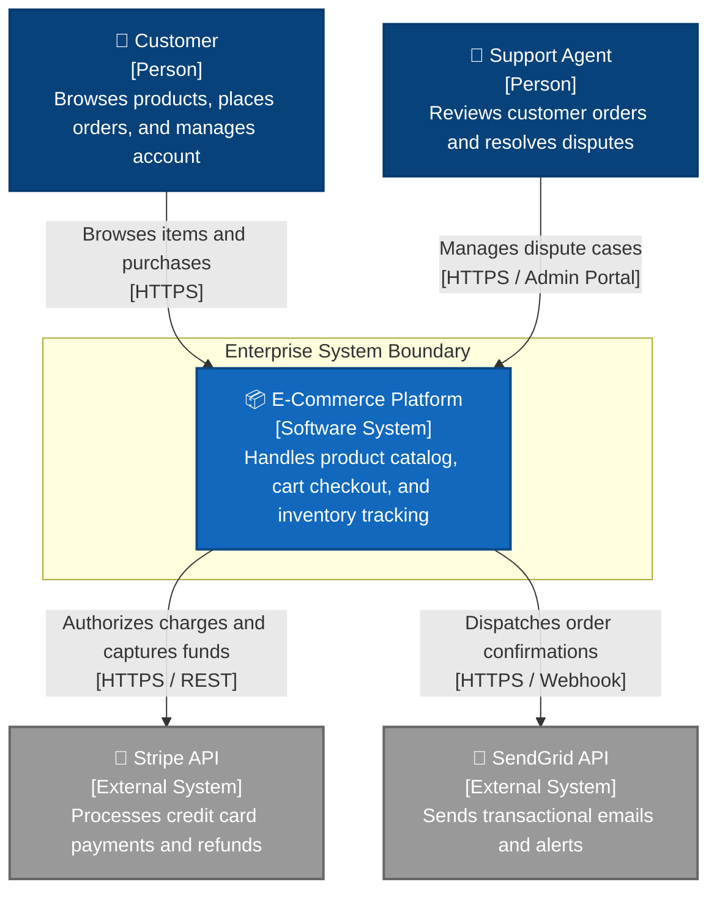
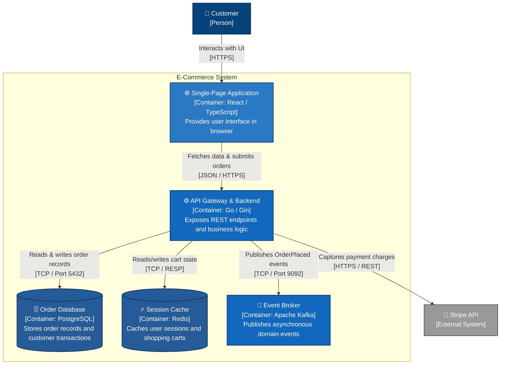
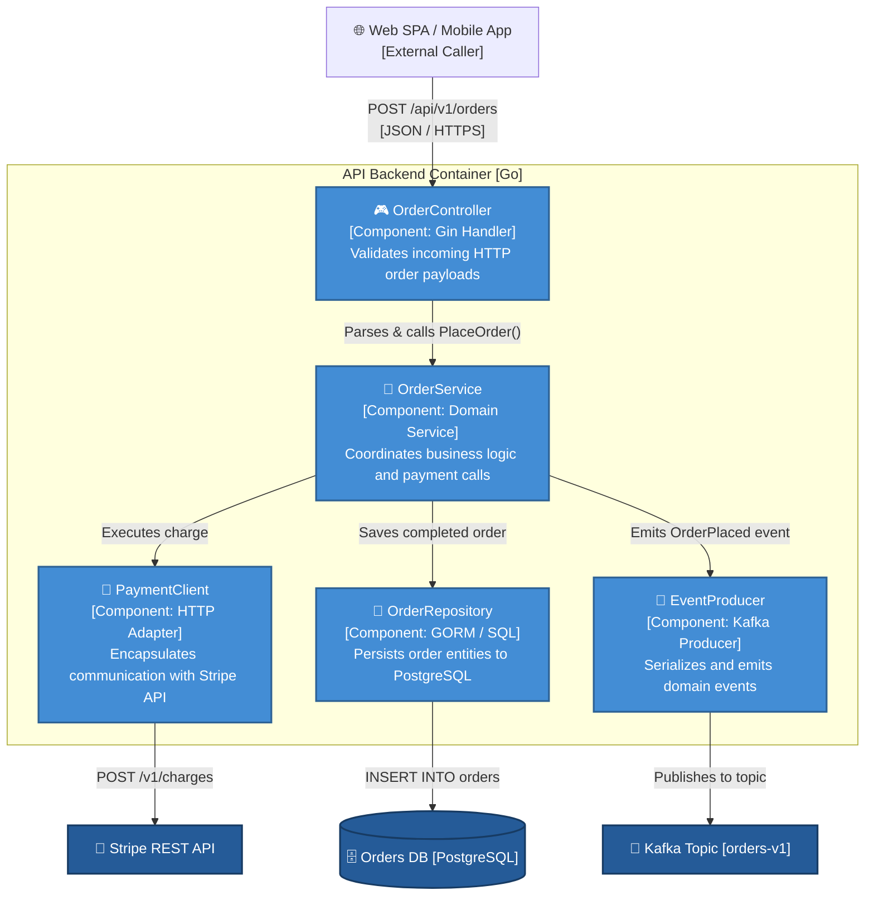

# C4 Model Diagramming Reference (Mermaid Diagrams-as-Code)

The C4 model (Context, Containers, Components, and Code) provides a hierarchical way to describe software architecture using different levels of zoom.

All diagrams generated under this skill MUST be written in pure **Mermaid markdown** (` ```mermaid `) so they render natively in GitHub, GitLab, Notion, and Markdown viewers without external binary dependencies.

> [!IMPORTANT]
> **Internal Agent Scaffolding**: C4 levels are the AI agent's mental model for zoom abstraction. **NEVER label headings as "C4 Model Level 1 System Context" or "C4 Level 2 Container Diagram" in generated documentation.** Instead, use natural headings like `### System Context`, `### Service Architecture`, and `### Component Interactions`.

---

## 1. The 4 Levels of Abstraction

| Level | Diagram Name | Audience | Answers | Key Elements |
|---|---|---|---|---|
| **Level 1** | **System Context** | Everyone (PM, UX, Devs, Ops, Execs) | *What is the software system and who uses it?* | System boundary, human users/personas, external third-party software systems. |
| **Level 2** | **Container** | Developers, DevOps, SRE, Architects | *What is the high-level technical shape of the system?* | Deployable units: web apps, single-page apps, mobile apps, API backends, databases, message buses, file stores. |
| **Level 3** | **Component** | Developers, Software Engineers | *How are the containers structured internally?* | Services, controllers, repositories, workers, queues within a single container. |
| **Level 4** | **Code** | Developers (Optional / Rarely Documented) | *How are classes/interfaces implemented?* | Class diagrams, ER diagrams. (Document only for complex domain patterns). |

---

## 2. Diagram Rules & Formatting Conventions

1. **Explicit Naming**: Every node must show **Name**, **[Technology / Type]**, and a brief **1-sentence description** of its role.
2. **Labeled Arrows**: Every relationship arrow must have an action verb and specify the protocol or communication mechanism (e.g., `HTTPS / JSON`, `gRPC`, `AMQP / Kafka`).
3. **Clear Boundaries**: Use Mermaid `subgraph` blocks to visually demarcate system boundaries and external scopes.
4. **Directionality**: Default to top-down (`flowchart TD`) or left-to-right (`flowchart LR`) flows. Keep the main user flow legible.

---

## 3. Copy-Pasteable Mermaid Templates

### Level 1: System Context Diagram Template



---

### Level 2: Container Diagram Template



---

### Level 3: Component Diagram Template



---

## 4. Sequence Diagram Template (Runtime View)

```mermaid
sequenceDiagram
    autonumber
    actor Customer as 👤 Customer
    participant UI as 🌐 Web App (SPA)
    participant API as ⚙️ API Backend
    participant DB as 🗄️ PostgreSQL
    participant Pay as 🏢 Stripe Gateway
    participant Bus as 📨 Kafka

    Customer->>UI: Clicks "Complete Purchase"
    UI->>API: POST /api/v1/orders (CartID, PaymentToken)
    activate API
    API->>API: Validate payload & idempotency key
    API->>Pay: Authorize & capture charge ($99.00)
    activate Pay
    Pay-->>API: 200 OK (ChargeID: ch_12345)
    deactivate Pay
    API->>DB: BEGIN TRANSACTION; INSERT order; COMMIT;
    activate DB
    DB-->>API: Row written (OrderID: ord_987)
    deactivate DB
    API->>Bus: Publish event `OrderPlaced(ord_987)`
    API-->>UI: 201 Created (OrderID: ord_987, Status: CONFIRMED)
    deactivate API
    UI-->>Customer: Renders confirmation screen
```
